<div align="center">
<h1>Using AI and Low-Cost Camera to Detect Harmful Algae</h1>


<br>


<br>


</div>

## Overview
Quickly detect and classify different species of harmful algae within natural water samples under a microscope in real-time via a fine-tuned convolutional neural network and low-cost camera (or, if preferred, smartphone).

The system can be used to monitor water quality and as a preventative measure for harmful algal blooms.

It's designed to be user-friendly and cost-effective, making it ideal for both research and educational purposes.

> [!TIP]
> Due to its modular, generalizable design, this project can be easily adapted and used to detect any and as many object(s) of your choosing (i.e., it's not limited to harmful algae).
> 
> To do so, all you'd need to change is the dataset, which would be comprised of images of the new object(s) you want to detect. You'd then use the dataset to [create a new, custom object detection model](#train-validate-and-test-model), save/download the `.pt` model, and follow the [steps to detect and classify algae](#detect-and-classify-algae).

<details open>
   <summary><b>Nikon microscope with ESP32-CAM AI Thinker and illuminator</b></summary>
   <div align="center"></div>
</details>

<details>
   <summary><b>Dataset Classes</b></summary>
   <table align="center" style="width: 100%; text-align: center;">
      <tr>
         <th style="text-align: center;">Name</th>
         <th style="text-align: center;" width="100%">Example</th>
      </tr>
      <tr>
         <td>Closterium</td>
         <td>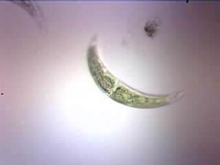</td>
      </tr>
      <tr>
         <td>Microcystis</td>
         <td></td>
      </tr>
      <tr>
         <td>Nitzschia</td>
         <td></td>
      </tr>
      <tr>
         <td>Oscillatoria</td>
         <td>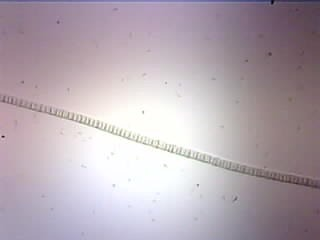</td>
      </tr>
      <tr>
         <td>Non-Algae</td>
         <td></td>
      </tr>
   </table>
</details>

<details>
   <summary><b>Diagrams</b></summary>
      <div align="center">
         <figure>
            <picture></picture><br>
            <figcaption>System Design (ESP32-CAM)</figcaption>
         </figure><br><br>
         <figure>
            <picture>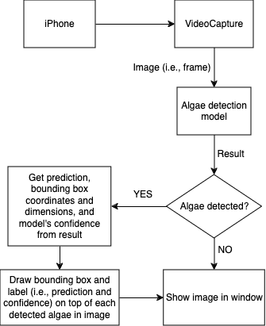</picture><br>
            <figcaption>System Design (iPhone)</figcaption>
         </figure><br><br>
         <figure>
            <picture>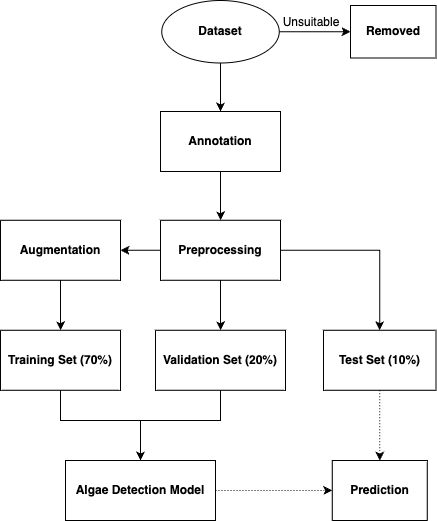</picture><br>
            <figcaption>Dataset Flowchart</figcaption>
         </figure><br><br>
         <figure>
            <picture></picture><br>
            <figcaption><a target="_blank" href="https://mmyolo.readthedocs.io/en/latest/recommended_topics/algorithm_descriptions/yolov8_description.html">YOLOv8 Architecture</a></figcaption>
         </figure><br><br>
         <figure>
            <picture></picture><br>
            <figcaption><a target="_blank" href="https://arxiv.org/abs/2202.06934">Slicing Aided Fine Tuning (SAFT) Framework</a></figcaption>
         </figure><br><br>
         <figure>
            <picture></picture><br>
            <figcaption><a target="_blank" href="https://arxiv.org/abs/2202.06934">Slicing Aided Hyper Inference (SAHI) Framework</a></figcaption>
         </figure><br><br>
         <figure>
            <picture></picture><br>
            <figcaption><code>streaming</code> UML</figcaption>
         </figure><br><br>
         <figure>
            <picture></picture><br>
            <figcaption><code>detection</code> UML</figcaption>
         </figure>
      </div>
</details>

<details>
   <summary><b>Models' Performance</b></summary>
   <table align="center" style="width: 100%; text-align: center; display: block; max-width: -moz-fit-content; max-width: fit-content; margin: 0 auto; overflow-x: auto; white-space: nowrap;">
      <tr>
         <th style="text-align: center;">[Pre-Trained] Model</th>
         <th style="text-align: center;">Confusion Matrix (Normalized)</th>
         <th style="text-align: center;">Precision-Confidence Curve</th>
         <th style="text-align: center;">Precision-Recall Curve</th>
         <th style="text-align: center;">Recall-Confidence Curve</th>
         <th style="text-align: center;">F1-Confidence Curve</th>
         <th style="text-align: center;">Training Results</th>
         <th style="text-align: center;">Validation Output</th>
         <th style="text-align: center;">Example Prediction</th>
      </tr>
      <tr>
         <td><a target="_blank" href="https://docs.ultralytics.com/models/yolov8">YOLOv8</a> Extra-Large</td>
         <td></td>
         <td>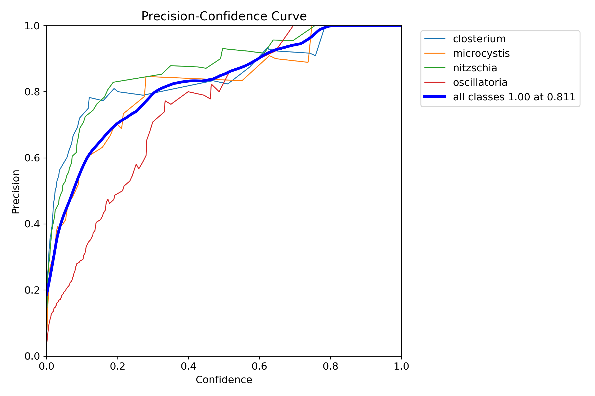</td>
         <td>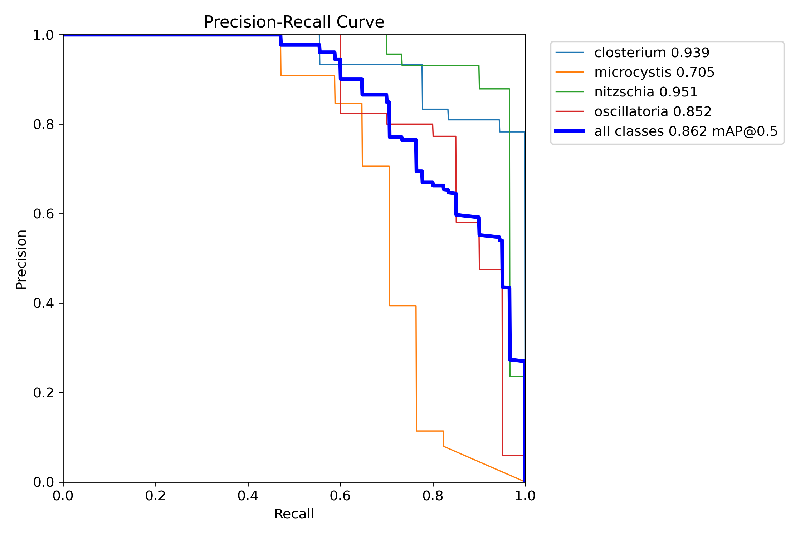</td>
         <td>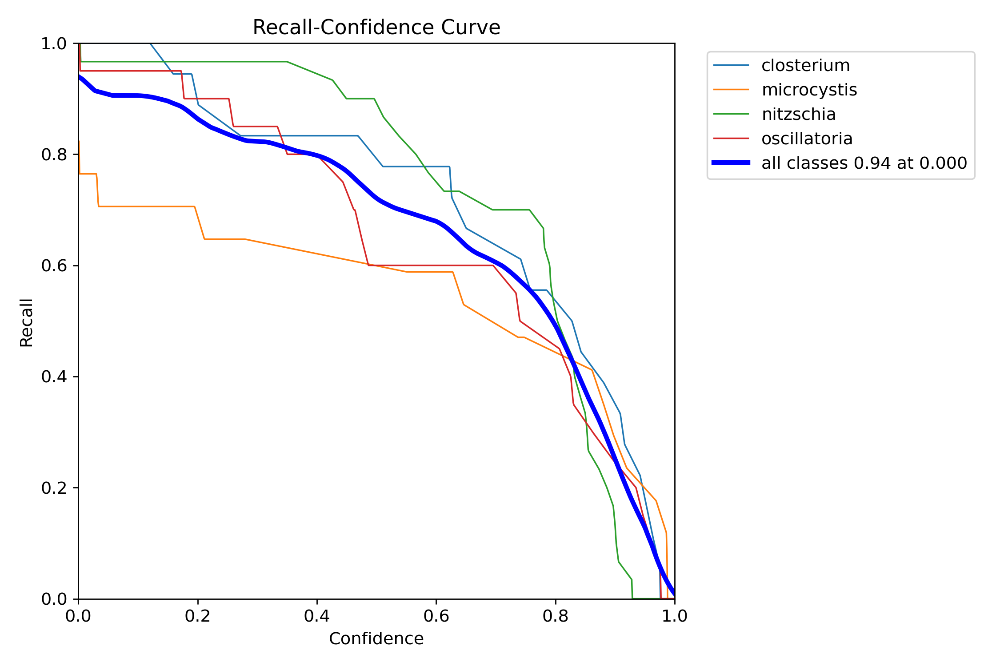</td>
         <td>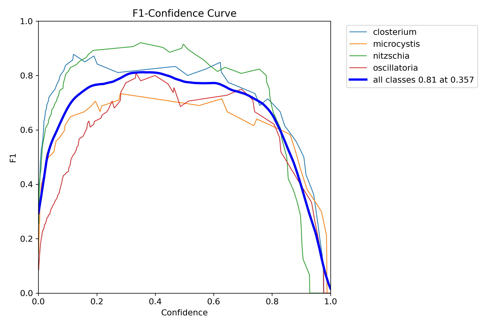</td>
         <td>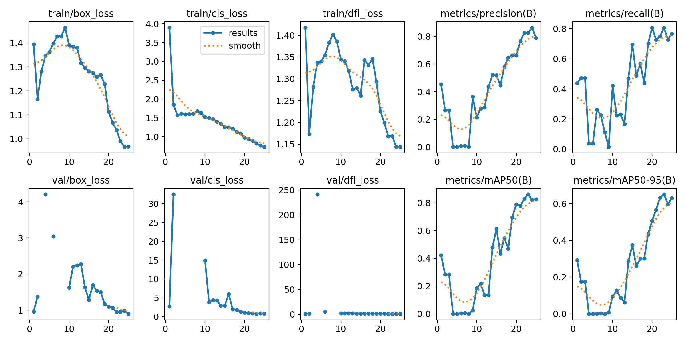</td>
         <td>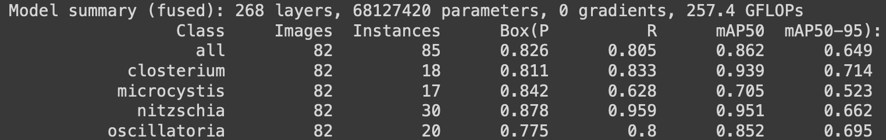</td>
         <td>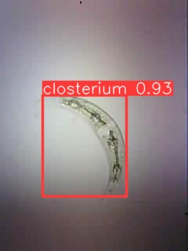</td>
      </tr>
      <tr>
         <td><a target="_blank" href="https://docs.ultralytics.com/models/yolov8">YOLOv8</a> Extra-Large v2</td>
         <td></td>
         <td></td>
         <td></td>
         <td></td>
         <td></td>
         <td></td>
         <td></td>
         <td>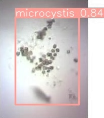</td>
      </tr>
      <tr>
         <td><a target="_blank" href="https://docs.ultralytics.com/models/yolov8">YOLOv8</a> Nano with <a target="_blank" href="https://docs.ultralytics.com/guides/sahi-tiled-inference">SAHI</a></td>
         <td>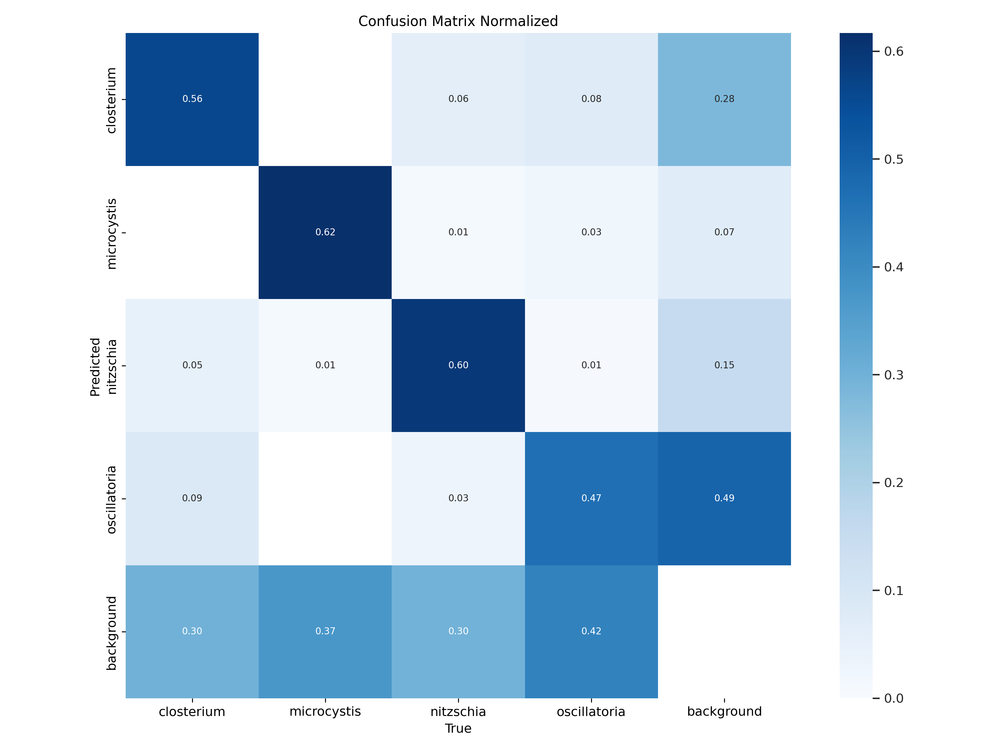</td>
         <td></td>
         <td></td>
         <td>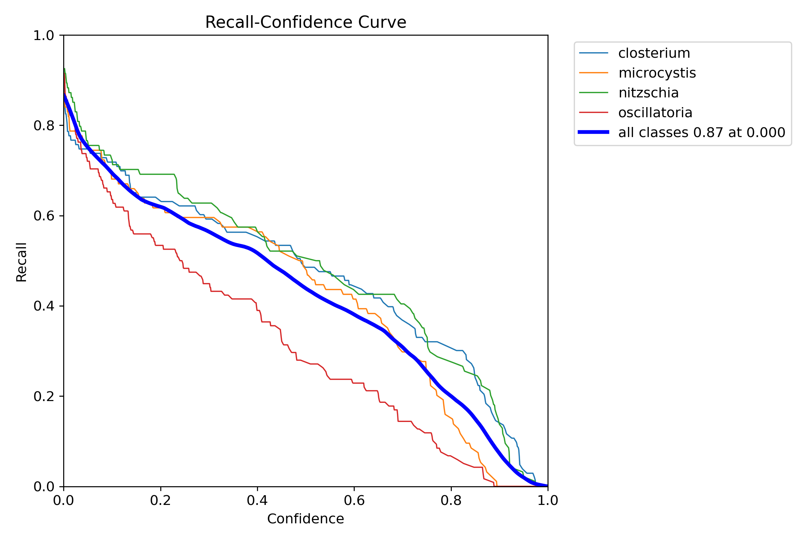</td>
         <td>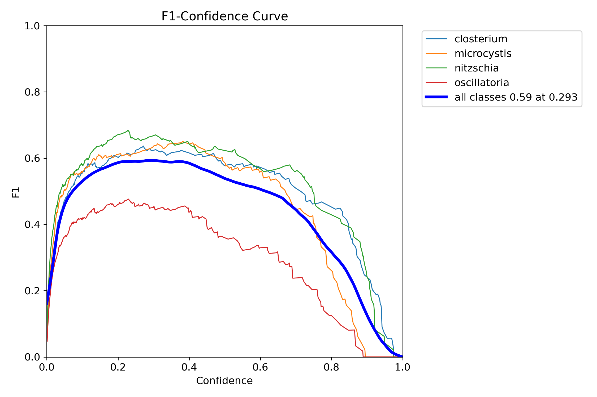</td>
         <td>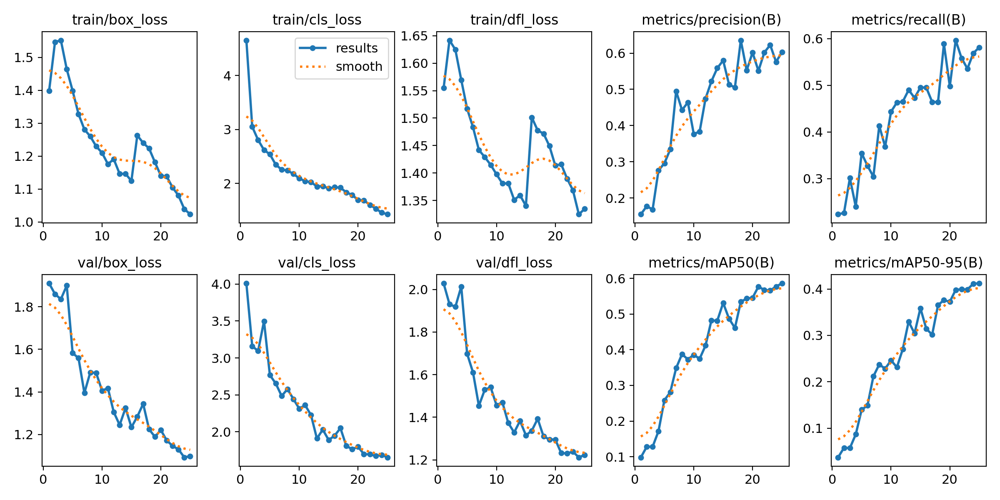</td>
         <td>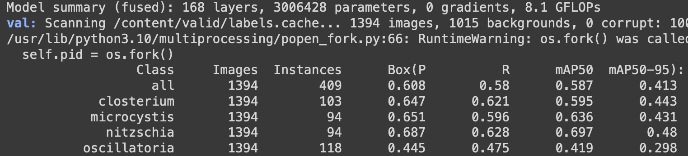</td>
         <td>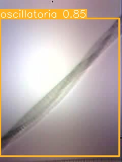</td>
      </tr>
   </table>
</details>

<details>
  <summary><b>Repository Structure</b></summary>
<pre>
.
├── assets/
│   ├── algae/
│   │   ├── closterium.jpg
│   │   ├── microcystis.jpg
│   │   ├── nitzschia.jpg
│   │   ├── non-algae.jpg
│   │   ├── oscillatoria.jpg
│   │   └── testing_sample.pdf
│   ├── diagrams/
│   │   ├── drawio/
│   │   │   ├── Camera_uml.drawio
│   │   │   ├── dataset_flowchart.drawio
│   │   │   ├── esp32_sys_design.drawio
│   │   │   └── streaming_uml.drawio
│   │   ├── dataset_flowchart.png
│   │   ├── detection_uml.png
│   │   ├── esp32_sys_des.png
│   │   ├── iphone_sys_des.png
│   │   ├── saft_framework.png
│   │   ├── sahi_framework.png
│   │   ├── streaming_uml.png
│   │   └── yolov8_architecture.jpg
│   ├── esp32/
│   │   ├── ai_thinker.jpg
│   │   ├── ap_popup.png
│   │   ├── board_port.png
│   │   ├── build_upload_monitor.png
│   │   ├── choose_ap.png
│   │   ├── config.png
│   │   ├── disconnect.png
│   │   ├── esp32_ip.png
│   │   ├── index.png
│   │   ├── init_config.png
│   │   ├── open_streaming.png
│   │   └── platformio_folder.png
│   ├── iphone/
│   │   ├── iphone_ui_connect.png
│   │   └── iphone_ui_disconnect.png
│   ├── models/
│   │   ├── custom_yolov8x/
│   │   │   ├── confusion_matrix_normalized.png
│   │   │   ├── confusion_matrix.png
│   │   │   ├── example.jpg
│   │   │   ├── F1_curve.png
│   │   │   ├── P_curve.png
│   │   │   ├── PR_curve.png
│   │   │   ├── R_curve.png
│   │   │   ├── results.png
│   │   │   └── validation.png
│   │   ├── custom_yolov8x_v2/
│   │   │   ├── confusion_matrix_normalized.png
│   │   │   ├── confusion_matrix.png
│   │   │   ├── example.jpg
│   │   │   ├── F1_curve.png
│   │   │   ├── P_curve.png
│   │   │   ├── PR_curve.png
│   │   │   ├── R_curve.png
│   │   │   ├── results.png
│   │   │   └── validation.png
│   │   └── sahi_yolov8n/
│   │       ├── confusion_matrix_normalized.png
│   │       ├── confusion_matrix.png
│   │       ├── example.jpg
│   │       ├── F1_curve.png
│   │       ├── P_curve.png
│   │       ├── PR_curve.png
│   │       ├── R_curve.png
│   │       ├── results.png
│   │       └── validation.png
│   ├── microscope.jpg
│   └── user_interface.png
├── src/
│   ├── detection/
│   │   ├── Camera.py
│   │   ├── esp32.py
│   │   ├── iphone.py
│   │   └── webcam.py
│   └── streaming/
│       ├── boards/
│       │   ├── esp32cam_ai_thinker.json
│       │   ├── esp32cam_espressif_esp_eye.json
│       │   ├── esp32cam_espressif_esp32s2_cam_board.json
│       │   ├── esp32cam_espressif_esp32s2_cam_header.json
│       │   ├── esp32cam_espressif_esp32s3_cam_lcd.json
│       │   ├── esp32cam_espressif_esp32s3_eye.json
│       │   ├── esp32cam_freenove_s3_wroom_n8r8.json
│       │   ├── esp32cam_freenove_wrover_kit.json
│       │   ├── esp32cam_m5stack_camera_psram.json
│       │   ├── esp32cam_m5stack_camera.json
│       │   ├── esp32cam_m5stack_esp32cam.json
│       │   ├── esp32cam_m5stack_unitcam.json
│       │   ├── esp32cam_m5stack_unitcams3.json
│       │   ├── esp32cam_m5stack_wide.json
│       │   ├── esp32cam_seeed_xiao_esp32s3_sense.json
│       │   ├── esp32cam_ttgo_t_camera.json
│       │   └── esp32cam_ttgo_t_journal.json
│       ├── html/
│       │   ├── index.html
│       │   └── index.min.html
│       ├── include/
│       │   ├── format_duration.h
│       │   ├── format_number.h
│       │   ├── lookup_camera_effect.h
│       │   ├── lookup_camera_frame_size.h
│       │   ├── lookup_camera_gainceiling.h
│       │   ├── lookup_camera_wb_mode.h
│       │   └── settings.h
│       ├── lib/
│       │   └── rtsp_server/
│       │       ├── library.json
│       │       ├── rtsp_server.cpp
│       │       └── rtsp_server.h
│       ├── src/
│       │   └── main.cpp
│       └── platformio.ini
├── weights/
│   ├── custom_yolov8x_v2.pt.zip
│   ├── custom_yolov8x.pt.zip
│   └── yolov8n_sahi.pt.zip
├── .gitattributes
├── .gitignore
├── environment.yml
├── LICENSE.md
└── README.md
</pre>
</details>

## Requirements
<details>
   <summary><b>ESP32-CAM (or similar)</b></summary>
      <ul>
         <li>AI Thinker</li>
         <li>Espressif ESP-EYE</li>
         <li>Espressif ESP32S2-CAM</li>
         <li>Espressif ESP32S3-CAM-LCD</li>
         <li>Espressif ESP32S3-EYE</li>
         <li>Freenove ESP32-WROVER</li>
         <li>M5Stack</li>
         <li>M5Stack ESP32CAM</li>
         <li>M5Stack PSRAM</li>
         <li>M5Stack Unit Cam</li>
         <li>M5Stack Unit CamS3</li>
         <li>M5Stack PSRAM</li>
         <li>M5Stack PSRAM 2.0</li>
         <li>M5Stack WIDE</li>
         <li>Seeed Studio XIAO ESP32S3 Sense</li>
         <li>TTGO T-Camera</li>
         <li>TTGO T-Journal</li>
      </ul>
</details>

- [x] Nikon microscope with 3D printed lens attachment and illuminator
- [x] Micro-USB cable
- [x] <a target="_blank" href="https://drive.google.com/drive/folders/1gd85o6dpcjDwWJUUi4x9slhjHHuoY4K0">Algae dataset</a>
- [x] <a target="_blank" href="https://code.visualstudio.com/download">Visual Studio Code</a>
- [x] <a target="_blank" href="https://platformio.org/install/ide?install=vscode">PlatformIO plugin for Visual Studio Code</a>
- [x] <a target="_blank" href="https://roboflow.com">Roboflow account</a>
- [x] <a target="_blank" href="https://accounts.google.com/ServiceLogin?passive=true&continue=https%3A%2F%2Fcolab.research.google.com">Google Colab account</a>
- [x] <a target="_blank" href="https://docs.continuum.io/free/anaconda/install">Anaconda</a> **OR** <a target="_blank" href="https://docs.conda.io/projects/miniconda/en/latest">Miniconda</a>

> [!TIP]
> If you have trouble deciding between Anaconda and Miniconda, please refer to the table below:
> <table>
> <thead>
> <tr>
> <th><center>Anaconda</center></th>
> <th><center>Miniconda</center></th>
> </tr>
> </thead>
> <tbody>
> <tr>
> <td>New to conda and/or Python</td>
> <td>Familiar with conda and/or Python</td>
> </tr>
> <tr>
> <td>Like the convenience of having Python and 1,500+ scientific packages automatically installed at once</td>
> <td>Want fast access to Python and the conda commands and plan to sort out the other programs later</td>
> </tr>
> <tr>
> <td>Have the time and space (a few minutes and 3 GB)</td>
> <td>Don't have the time or space to install 1,500+ packages</td>
> </tr>
> <tr>
> <td>Don't want to individually install each package</td>
> <td>Don't mind individually installing each package</td>
> </tr>
> </tbody>
> </table>

## Installation
1. Verify that conda is installed
   ```
   conda --version
   ```

2. Ensure conda is up to date
   ```
   conda update conda
   ```

3. Enter the directory you want `algae-detection` to be cloned in
     * POSIX
       ```sh
       cd ~/path/to/directory
       ```
     * Windows
       ```sh
       cd C:\Users\user\path\to\directory
       ```

4. Clone `algae-detection`
   ```sh
   git clone https://github.com/lynkos/algae-detection.git && cd algae-detection
   ```

> [!IMPORTANT]
> Due to the [large] size of the repo, you may get errors such as:
> 
> <pre>error: RPC failed; curl 56 Recv failure: Connection reset by peer error: 6022 bytes of body are still expected fetch-pack: unexpected disconnect while reading sideband packet fatal: early EOF fatal: fetch-pack: invalid index-pack output</pre>
>
> If this is the case, please download <a target="_blank" href="https://git-lfs.com">Git LFS</a> and try cloning again. If you're still getting errors, consider <a target="_blank" href="https://github.com/git-guides/git-clone#git-clone-with-ssh">cloning via SSH</a> (`git clone git@github.com:lynkos/algae-detection.git`) or <a target="_blank" href="https://github.com/lynkos/algae-detection/archive/refs/heads/main.zip">manually downloading the repo as a `.zip` file</a> and decompressing it.

5. Create conda virtual environment from [`environment.yml`](environment.yml)
   ```
   conda env create -f environment.yml
   ```

6. Activate `algae_env`
   ```
   conda activate algae_env
   ```

7. Confirm that `algae_env` is active
     * If active, `algae_env` should be in parentheses () or brackets [] before your command prompt, e.g.
       ```
       (algae_env) $
       ```
     * If necessary, see which virtual environments are available and/or currently active (active environment denoted with asterisk (*))
       ```
       conda info --envs
       ```
       **OR**
       ```
       conda env list
       ```

> [!TIP]
> Instead of manually typing out the entire conda command, you can add the following to your shell setup file (e.g., `.bashrc`, etc.) to save time.
> 
> **WARNING**: These have **ONLY** been tested on `bash v5.2.26(1)-release` with `aarch64-apple-darwin23.2.0` architecture, so they may not work as expected on other shells or versions! Try testing each command individually beforehand, and use with caution!
> <details open>
> <summary><b>Shell Scripts: Conda Shortcuts</b></summary>
> 
> ```sh
> # Deactivate current conda environment
> alias dac='conda deactivate'
>
> # Helper function to prompt user for 'Yes' or 'No' response
> ask() {
>     read -p "$@ (Y/N)? " answer
>     case "${answer}" in
>     [yY] | [yY][eE][sS])
>         true
>         ;;
>     *)
>         false
>         ;;
>     esac
> }
>
> # Create conda environment(s) from .yml / .yaml file(s) or CLI
> # Usage (with file(s)): mkenv [file1.yml] [file2.yml] ... [fileN.yml]
> # Usage (without file(s)): mkenv [env_name] [package1] [package2] ... [packageN]
> mkenv() {
>     if ask "Create environment(s) from file(s)?"; then
>         if [ $# == 0 ]; then
>             conda env create
>
>         else
>             for file in "$@"; do
>                 [ -f $file ] && conda env create -f $file ||
>                 echo "ERROR: $file doesn't exist."
>             done
>         fi
>
>     else
>         if [ $# == 0 ]; then
>             echo "ERROR: Invalid number of args. Must include:"
>             echo "	* New env's name"
>             echo "	* [OPTIONAL] New env's package(s)"
>
>         else
>             conda create -n "$@"
>         fi
>     fi
> }
>
> # Delete conda environment(s)
> # Usage: rmenv [env1] [env2] ... [envN]
> rmenv() {
>     for env in "$@"; do
>         if ask "Are you sure you want to delete $env?"; then
>             [ -e $(conda info --base)/envs/$env ] &&
>             conda env remove -n $env -y &&
>             rm -rf $(conda info --base)/envs/$env ||
>             echo "ERROR: $env doesn't exist."
>         fi
>     done
> }
>
> # Rename conda environment
> # Usage: rnenv [env_name] [new_name]
> rnenv() {
>     if [ $# == 2 ]; then
>         if [ $CONDA_SHLVL == 0 ]; then
>             act
>             conda rename -n "$1" "$2"
>             dac
>
>         else
>             conda rename -n "$1" "$2"
>         fi
>
>     else
>         echo "ERROR: Invalid number of args. Must include:"
>         echo "	* Env's current name"
>         echo "	* Env's new name"
>     fi
> }
>
> # Copy conda environment
> # Usage: cpenv [env_name] [copy_name]
> cpenv() {
>     if [ $# == 2 ]; then
>         conda create -n "$2" --clone "$1"
>
>     else
>         echo "ERROR: Invalid number of args. Must include:"
>         echo "	* Source env's name"
>         echo "	* Env copy's name"
>     fi
> }
>
> # Activate conda environment
> # Usage: act [env_name]
> act() {
>     if [ $# == 1 ]; then
>         conda activate "$1"
>
>     elif [ $# == 0 ]; then
>         conda activate
>
>     else
>         echo "ERROR: Invalid number of args. At most 1 env name is required."
>     fi
> }
>
> # Export [explicit] spec file for building identical conda environments
> # Usage: exp [file_name]
> exp() {
>     if [ $# == 0 ]; then
>         if ask "Export explicit specs?"; then
>             conda list --explicit > environment.yml
>
>         else
>             conda env export --from-history > environment.yml
>         fi
>
>     elif [ $# == 1 ]; then
>         if ask "Export explicit specs?"; then
>             conda list --explicit > "$1"
>
>         else
>             conda env export --from-history > "$1"
>         fi
>
>     else
>         echo "ERROR: Invalid number of args. At most 1 file name is required."
>     fi
> }
>
> # Output [explicit] packages in conda environment
> # Usage: lsenv
> lsenv() {
>     if ask "List explicit specs?"; then
>         conda list --explicit
>
>     else
>         conda list
>     fi
> }
> ```
> </details>

## Usage
### Detect and Classify Algae
<details open>
   <summary><b>User Interface</b></summary>
   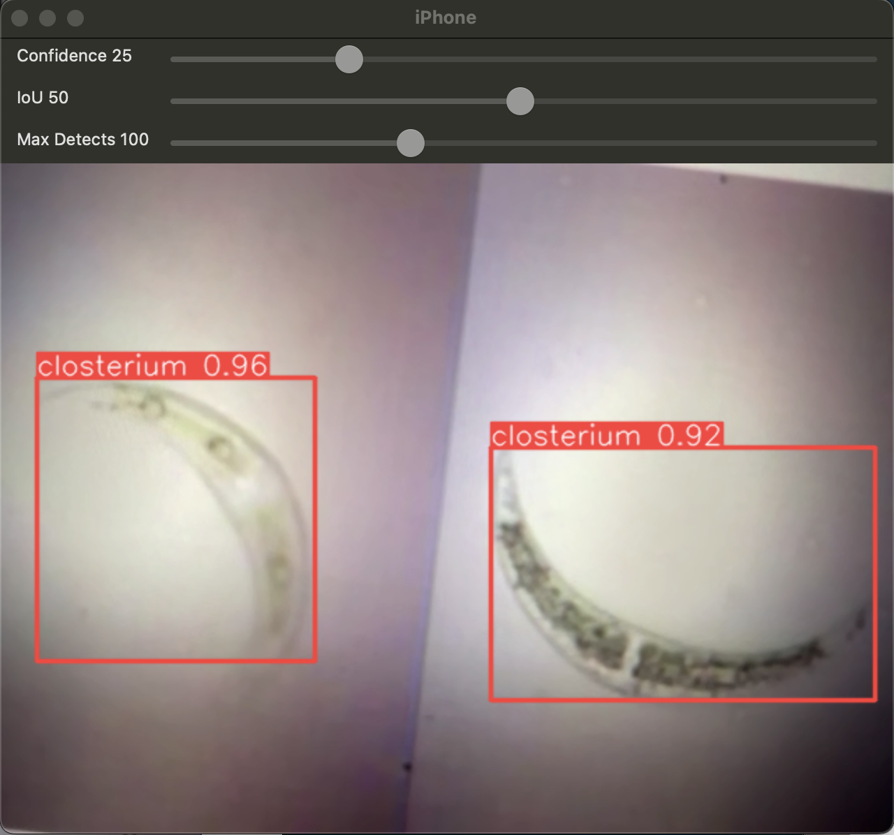
</details>

1. Open [`weights`](weights)

2. Choose the algae detection model you want to use

> [!TIP]
> * To use your own `.pt` model, add it to [`weights`](weights).
>
> * To use an existing model, decompress the `.zip` file to get the `.pt` model.
>     * <a target="_blank" href="https://docs.ultralytics.com/models/yolov8">YOLOv8</a> Nano with <a target="_blank" href="https://docs.ultralytics.com/guides/sahi-tiled-inference">SAHI</a>: [`yolov8n_sahi.pt.zip`](weights/yolov8n_sahi.pt.zip)
>     * <a target="_blank" href="https://docs.ultralytics.com/models/yolov8">YOLOv8</a> Extra-Large: [`custom_yolov8x.pt.zip`](weights/custom_yolov8x.pt.zip), [`custom_yolov8x_v2.pt.zip`](weights/custom_yolov8x_v2.pt.zip)

3. Open [`Camera.py`](src/detection/Camera.py)

4. Set [`MODEL_PATH`](src/detection/Camera.py#L25) to path of desired `.pt` model

5. Read the following depending on which camera you'll use
   * [ESP32](#esp32)
   * [iPhone](#iphone)
   * [Webcam](#webcam)

#### ESP32
> [!IMPORTANT]
> * Current implementation **requires** WiFi!
>     * This is because the ESP32-CAM livestreams to an <a target="_blank" href="https://en.wikipedia.org/wiki/Motion_JPEG#Video_streaming">MJPEG server</a> over HTTP, which is how [`esp32.py`](src/detection/esp32.py) gets the camera input.
>     * Unfortunately, WiFi connections from hotspots or SSOs are — in my experience — incompatible.
> 
> * If you're more of a visual learner, here's the <a target="_blank" href="https://youtu.be/SxlSjRWeGuw">YouTube tutorial + demo</a>.
>     * Make sure you've [installed the necessary software](#installation) **AND** have completed Step #1–4 of the [Detect and Classify Algae section](#detect-and-classify-algae) before following the tutorial.

1. Click the PlatformIO icon in the activity bar, then click 'Pick a folder'
   <div align="center">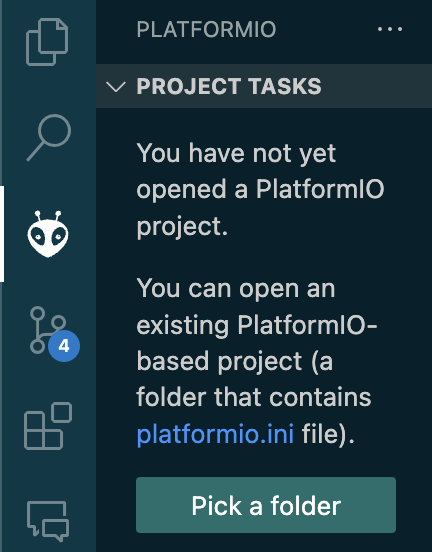</div>

2. Open [`streaming`](src/streaming)
   <div align="center"></div>

3. Connect the ESP32 to your computer with the Micro-USB cable, then select its board type and USB port at the bottom of the window
   <div align="center"></div>

4. Build and upload code to ESP32
   - Click 'Build' to compile code
   - Click 'Upload' to flash code to ESP32
   <div align="center"></div>

5. To connect initially to the device, connect to the WiFi network starting with `ESP32CAM-RTSP`
   <div align="center"></div>

6. Click 'Change settings' once the browser automatically opens the home page (<a target="_blank" href="http://192.168.4.1">`http://192.168.4.1`</a>)
   <div align="center"></div>

7. You **must** fill in all of the following fields:
   - AP (i.e., Access Point) password
   - WiFi SSID
   - WiFi password (if applicable)
   <div align="center">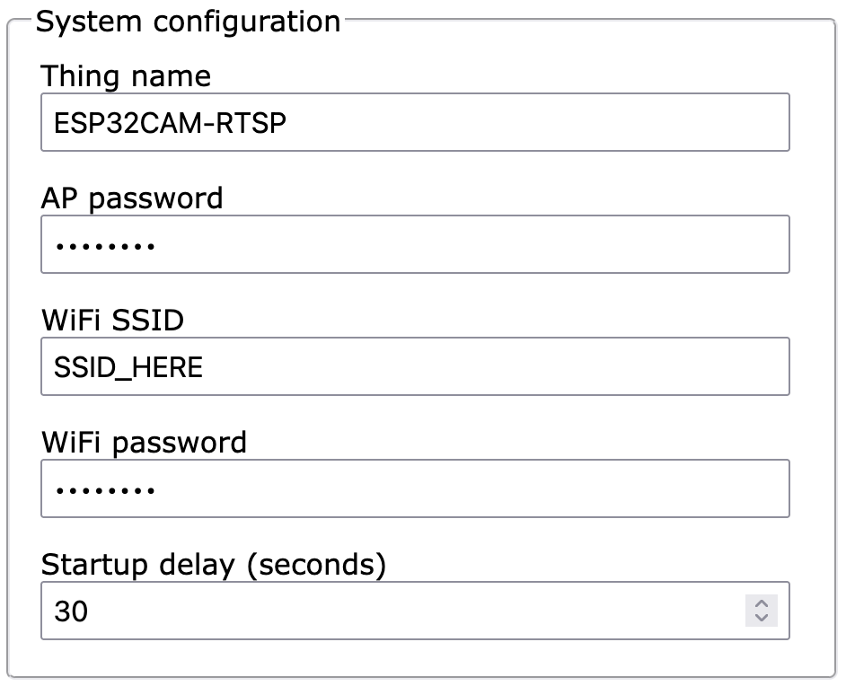</div>

 > [!NOTE]
 > If you ever lose/forget the AP password, click 'Erase flash' (in PlatformIO's extension UI) to erase and reset the device, then follow steps 4 and onwards again.

8. Update the settings and configure camera options (you can always change them later)
   <details>
      <summary><b>Camera Settings</b></summary>
      <div align="center">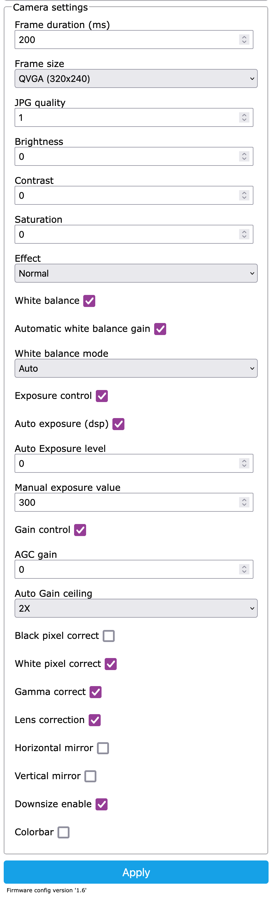</div>
   </details>

> [!WARNING]
> Very low number for 'JPG quality' (i.e., very high quality) may cause the ESP32 to crash or return no image!

9. Scroll down and click 'Apply' to save settings

> [!IMPORTANT]
> You must reset the ESP32 (i.e., press its 'Reset' button) everytime you change the settings for it to take effect.

10. Disconnect from the current network and reconnect to your WiFi in order to reset ESP32 and connect to the AP
      <div align="center"></div>
      
> [!NOTE]
> If there's an error screen saying it's unable to make a connection, try resetting the ESP32 first. It'll wait 30 seconds for a connection (can be changed in system configuration's 'Startup delay (seconds)' setting, shown in Step #7).
>
> Connect to the SSID, go to the ESP32's IP address and enter your credentials:
> - Username: `admin`
> - Password: AP password from Step #7

11. Go back to PlatformIO and click 'Monitor' to determine the ESP32's IP address

> [!TIP]
> To quickly find the IP address:
> - PC
>   ```
>   Ctrl + F
>   ```
> - Mac
>   ```
>   ⌘ + F
>   ```
>
> Then type 'IP Address' in the search bar and press 'Enter'.
> <div align="center">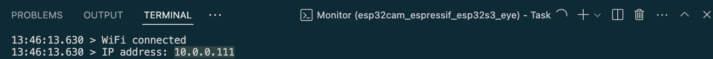</div>

12. You can now stream from the ESP32
    - HTTP Motion JPEG Streamer: `http://<ESP32 IP address>/stream`
    - HTTP Image: `http://<ESP32 IP address>/snapshot`
    - RTSP: `rtsp://<ESP32 IP address>:554/mjpeg/1`
    <details>
      <summary><b>Home Page</b></summary>
      <div align="center"></div>
    </details>

> [!CAUTION]
> Anyone with network access to the device can see the streams and images!

13. Open [`esp32.py`](src/detection/esp32.py) once finished

14. Set [`URL`](src/detection/esp32.py#L3) to ESP32's IP address (i.e., `http://10.0.0.111` in this example)

15. Run [`esp32.py`](src/detection/esp32.py)
    * POSIX
      ```
      python src/detection/esp32.py
      ```
    * Windows
      ```
      python src\detection\esp32.py
      ```

> [!NOTE]
> See <a target="_blank" href="https://github.com/rzeldent/esp32cam-rtsp">this module</a>'s <a target="_blank" href="https://github.com/rzeldent/esp32cam-rtsp/blob/main/README.md">`README.md`</a> for further details on [`streaming`](src/streaming).
> 
> To update to latest version, commit and push changes, then run the following command in the terminal:
> ```sh
> git subtree pull --prefix src/streaming https://github.com/rzeldent/esp32cam-rtsp.git develop --squash
> ```

#### iPhone
1. Open [`iphone.py`](src/detection/iphone.py)

2. Run [`iphone.py`](src/detection/iphone.py)
   * POSIX
      ```
      python src/detection/iphone.py
      ```
   * Windows
      ```
      python src\detection\iphone.py
      ```

3. If successfully connected, your iPhone's screen should look like this:
   <div align="center">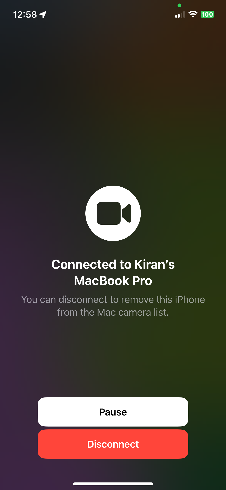</div>

4. Press 'Escape' on your computer or 'Disconnect' on your iPhone to exit the program
   <div align="center">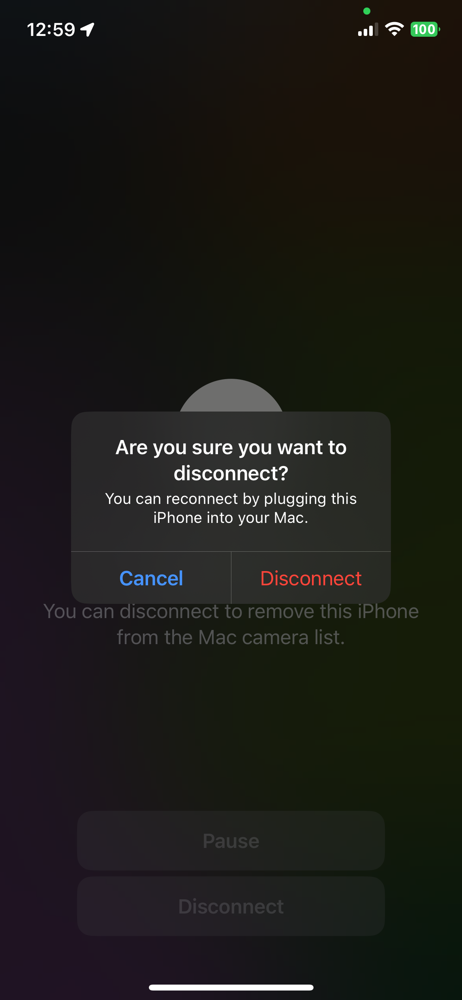</div>

#### Webcam
1. Open [`webcam.py`](src/detection/webcam.py)

2. Run [`webcam.py`](src/detection/webcam.py)
   * POSIX
      ```
      python src/detection/webcam.py
      ```
   * Windows
      ```
      python src\detection\webcam.py
      ```

### Train, Validate, and Test Model
1. Visit <a target="_blank" href="https://colab.research.google.com/drive/19X4aGWTeXQbgEKVteR9qrgit67jNxkmJ">this Google Colab notebook</a>

2. Follow the notebook's instructions step-by-step

## Appendix
### Future Work
- [ ] Increase dataset and improve model accuracy and versatility by taking quality images of various types of algae
   - At least <a target="_blank" href="https://blog.roboflow.com/model-best-practices/#dataset-size">1000 images per class</a>
   - <a target="_blank" href="https://blog.roboflow.com/handling-unbalanced-classes">All classes are balanced</a> (i.e., have roughly the same amount of images)
   - <a target="_blank" href="https://case.fiu.edu/about/directory/profiles/manning-schonna-r..html">Dr. Schonna R. Manning</a> may be able to help with categorizing any algae in new images
- [ ] Connect to ESP32 without a server (e.g., via USB, etc.), just like Webcam and iPhone OR use RTSP instead of HTTP
- [ ] Heatsink for ESP32 to prevent overheating
- [ ] Use DC-GAN to generate additional synthetic images for training
- [ ] Try different models, such as <a target="_blank" href="https://paperswithcode.com/method/retinanet">RetinaNet</a> and <a target="_blank" href="https://docs.ultralytics.com/models/yolov9">YOLOv9</a>
- [ ] Run model on ESP32 rather than on computer
- [ ] Update microscope's 3D printed lens attachment by making it adjustable **AND/OR** create multiple ones for different devices, e.g., iPhone, Android, etc.
- [ ] Add Android compatibility (if applicable and/or necessary)

### Further Reading
- <a target="_blank" href="https://www.usgs.gov/news/national-news-release/ usgs-finds-28-types-cyanobacteria-florida-algal-bloom">USGS Finds 28 Types of Cyanobacteria in Florida Algal Bloom</a>
- <a target="_blank" href="https://myfwc.com/research/wildlife/health/cyanobacteria/#:~:text=Approximately%2020%20cyanobacteria%20species%20in,than%20one%20type%20of%20toxin">Cyanobacteria (Blue-Green Algae)</a>
- <a target="_blank" href="https://pubs.usgs.gov/publication/ofr20171054">Cyanobacteria of the 2016 Lake Okeechobee and Okeechobee Waterway Harmful Algal Bloom</a>
- <a target="_blank" href="https://www.mdpi.com/2073-4441/14/14/2219">Computer Vision Based Deep Learning Approach for the Detection and Classification of Algae Species Using Microscopic Images</a>
- Research "<a target="_blank" href="https://www.google.com/search?q=toxic+cyanobacteria">toxic cyanobacteria</a>"

### Glossary
1. **Access Point (AP)**: Networking device that allows wireless-capable devices to connect to a WLAN; in this case, it provides WiFi to ESP32
2. **Algae**: Group of mostly aquatic, photosynthetic, and nucleus-bearing organisms that lack many features of larger multicellular plants
3. **Anaconda**: Open-source platform for managing and installing various Python packages
4. **Artificial Intelligence (AI)**: Simulation of human intelligence in machines that can perform tasks like problem-solving, decision-making, learning, etc.
5. **Deep Neural Network (DNN)**: ML method inspired by the human brain’s neural structure that can recognize complex patterns in data (e.g., pictures, text, sounds, etc.) to produce accurate insights and predictions
6. **Closterium**: Type of algae identified by their elongated or crescent shape
7. **Computer Vision (CV)**: Field of computer science that focuses on enabling computers to identify and understand objects and people in images and videos
8. **Confusion Matrix**: Visualizes model performance (i.e., number of correct and incorrect predictions per class), where the x-axis is the true value and y-axis is the model’s predicted value; diagonal elements represent the number of points for which the predicted label is equal to the true label (higher diagonal values are better since it indicates many correct predictions), off-diagonal elements are those mislabeled by the model (lower off-diagonal elements are better since it indicates lack of incorrect predictions)
9. **Convolutional Neural Network (CNN)**: Type of DNN specifically designed for image recognition and processing
10. **Epoch**: One complete iteration of the entire training dataset through the ML algorithm
11. **ESP32**: Series of low-cost, low-power system-on-chip microcontrollers with integrated WiFi and Bluetooth capabilities
12. **Espressif**: Manufacturer of ESP32 microcontrollers 
13. **Google Colab**: Hosted Jupyter Notebook service that requires no setup to use and provides both free and paid access to computing resources, including GPUs and TPUs
14. **Graphics Processing Unit (GPU)**: Specialized electronic circuit that can perform mathematical calculations at high speed; useful for training AI and DNNs
15. **Inference**: Process of using a trained ML model to make predictions, classifications, and/or detections on new data
16. **Local Access Network (LAN)**: Group of connected computing devices within a limited area (usually sharing a centralized Internet connection) that can communicate and share resources amongst each other
17. **Machine Learning (ML)**: Subfield of AI that involves training computer systems to learn from data and make decisions or predictions without being explicitly programmed
18. **Microcystis**: Very toxic genus of cyanobacteria which look like clusters of small dots and is known for forming harmful algal blooms in bodies of water
19. **Motion JPEG (MJPEG)**: Video compression format where each frame of a digital video sequence is compressed separately as a JPEG image
20. **Weights**: Numbers associated with the connections between neurons/nodes across different layers of a DNN
21. **Nitzschia**: Type of thin, elongated algae that can cause harmful algal blooms
22. **Normalize**: Within the context of confusion matrices, it means the matrix elements are displayed as a percentage
23. **Oscillatoria**: Genus of filamentous cyanobacteria that forms blue-green algal blooms
24. **PlatformIO**: Cross-platform, cross-architecture, multi-framework tool for embedded system engineers and software engineers who write embedded applications
25. **Python**: High-level programming language widely used for data analysis and ML
26. **PyTorch**: ML library used for various applications, including CV
27. **Red Tide**: Event which occurs on Florida’s coastline where algae grows uncontrollably
28. **Roboflow**: CV developer framework for better data collection, dataset preprocessing, dataset augmentation, model training techniques, model deployment, and more
29. **Slicing Aided Fine Tuning (SAFT)**: Novel approach that augments the fine-tuning dataset by dividing images into overlapping patches, thus providing a more balanced representation of small objects and overcoming the bias towards larger objects in the original pre-training datasets
30. **Slicing Aided Hyper Inference (SAHI)**: Common method of improving the detection accuracy of small objects, which involves running inference over portions of an image then accumulating the results
31. **Tensor Processing Unit (TPU)**: Google’s application-specific integrated circuit (ASIC) used to accelerate ML workloads; useful for training AI and DNNs
32. **Ultralytics**: Company that aims to make AI model development accessible, efficient to train, and easy to deploy
33. **Wireless Local Area Network (WLAN)**: Computer network that links two or more devices using wireless communication to form a LAN
34. **YOLOv8**: Version 8 of You Only Look Once, a high performance real-time object detection and image segmentation model developed by Ultralytics

## Credits
Special thanks to:

- <a target="_blank" href="https://ieeexplore.ieee.org/author/37291140300">Dr. Antao Chen</a> (product owner) for his mentorship
- <a target="_blank" href="https://github.com/rdgbrian">rdgbrian</a> (Fall 2023 team lead) for his assistance
- <a target="_blank" href="https://github.com/rzeldent">rzeldent</a> for <a target="_blank" href="https://github.com/rzeldent/esp32cam-rtsp/tree/develop">ESP32CAM-RTSP</a>, which has been slightly modified and added as a git subtree in [`streaming`](src/streaming)
