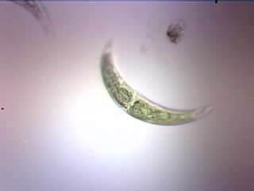
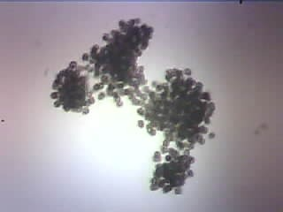
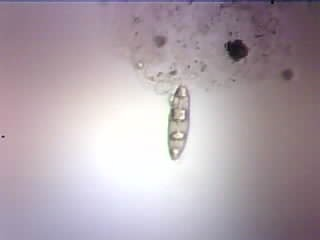
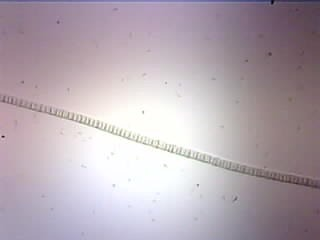
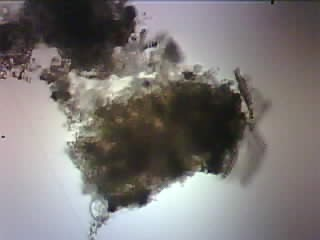

<div align="center">
<h1>Using AI and Low-Cost Camera to Detect Harmful Algae</h1>


<br>


</div>

## Overview
Quickly detect and classify different species of harmful algae within natural water samples under a microscope in real-time via a fine-tuned convolutional neural network and low-cost camera (or, if preferred, smartphone).

The system can be used to monitor water quality and as a preventative measure for harmful algal blooms.

It's designed to be user-friendly and cost-effective, making it ideal for both research and educational purposes.

<details open>
   <summary><b>Nikon microscope equipped with ESP32-CAM AI Thinker and illuminator</b></summary>
   <div align="center"></div>
</details>

<details>
   <summary><b>Dataset Classes</b></summary>
   <table align="center" style="width: 100%; text-align: center;">
      <tr>
         <th style="text-align: center;">Name</th>
         <th style="text-align: center;" width="100%">Example</th>
      </tr>
      <tr>
         <td>Closterium</td>
         <td></td>
      </tr>
      <tr>
         <td>Microcystis</td>
         <td></td>
      </tr>
      <tr>
         <td>Nitzschia</td>
         <td></td>
      </tr>
      <tr>
         <td>Oscillatoria</td>
         <td></td>
      </tr>
      <tr>
         <td>Non-Algae</td>
         <td></td>
      </tr>
   </table>
</details>

<details>
  <summary><b>Repository Structure</b></summary>
<pre>
.
├── documentation/
│   ├── installation_guide.md
│   ├── test_algae.pdf
│   └── user_manual.md
├── posters/
│   ├── cristian.pdf
│   ├── justin.pdf
│   └── kiran.pdf
├── presentation_slides
├── src/
│   ├── assets/
│   │   ├── algae/
│   │   │   ├── closterium.jpg
│   │   │   ├── microcystis.jpg
│   │   │   ├── nitzschia.jpg
│   │   │   ├── non-algae.jpg
│   │   │   └── oscillatoria.jpg
│   │   ├── custom_yolov8x/
│   │   │   ├── F1_curve.png
│   │   │   ├── PR_curve.png
│   │   │   ├── P_curve.png
│   │   │   ├── R_curve.png
│   │   │   ├── confusion_matrix.png
│   │   │   ├── confusion_matrix_normalized.png
│   │   │   ├── labels.jpg
│   │   │   ├── labels_correlogram.jpg
│   │   │   ├── results.png
│   │   │   └── validation.png
│   │   ├── sahi_yolov8n/
│   │   │   ├── F1_curve.png
│   │   │   ├── PR_curve.png
│   │   │   ├── P_curve.png
│   │   │   ├── R_curve.png
│   │   │   ├── confusion_matrix.png
│   │   │   ├── confusion_matrix_normalized.png
│   │   │   ├── results.png
│   │   │   └── validation.png
│   │   ├── esp32cam_ai_thinker.jpg
│   │   ├── index.png
│   │   ├── microscope.jpg
│   │   └── stream_settings_ui.png
│   ├── detection/
│   │   ├── base.py
│   │   ├── esp32.py
│   │   └── other.py
│   ├── streaming/
│   │   ├── boards/
│   │   │   └── esp32cam_ai_thinker.json
│   │   ├── html/
│   │   │   ├── index.html
│   │   │   └── index.min.html
│   │   ├── include/
│   │   │   ├── format_duration.h
│   │   │   ├── format_number.h
│   │   │   ├── lookup_camera_effect.h
│   │   │   ├── lookup_camera_frame_size.h
│   │   │   ├── lookup_camera_gainceiling.h
│   │   │   ├── lookup_camera_wb_mode.h
│   │   │   └── settings.h
│   │   ├── lib/
│   │   │   └── rtsp_server/
│   │   │       ├── library.json
│   │   │       ├── rtsp_server.cpp
│   │   │       └── rtsp_server.h
│   │   ├── src/
│   │   │   └── main.cpp
│   │   ├── generate_html.ps1
│   │   ├── generate_html.sh
│   │   ├── minify.py
│   │   ├── platformio.ini
│   │   └── README.md
│   └── model_pipeline.ipynb
├── videos/
│   └── index.html
├── weights/
│   ├── yolov8n_sahi.pt.zip
│   └── custom_yolov8x.pt.zip
├── .gitattributes
├── .gitignore
├── environment.yml
└── README.md
</pre>
</details>

## Requirements
- [x] ESP32-CAM AI Thinker
- [x] Nikon microscope with 3D printed lens attachment and illuminator
- [x] USB-C cable
- [x] Dataset
- [x] [Visual Studio Code](https://code.visualstudio.com/download)
- [x] [PlatformIO plugin for Visual Studio Code](https://docs.platformio.org/en/stable/integration/ide/vscode.html)
- [x] [Roboflow account](https://roboflow.com)
- [x] [Google Colab account](https://colab.research.google.com)
- [x] [Anaconda](https://docs.continuum.io/free/anaconda/install) **OR** [Miniconda](https://docs.conda.io/projects/miniconda/en/latest)

> [!NOTE]
> If you have trouble deciding between Anaconda and Miniconda, please refer to the table below:
> <table>
> <thead>
> <tr>
> <th><center>Anaconda</center></th>
> <th><center>Miniconda</center></th>
> </tr>
> </thead>
> <tbody>
> <tr>
> <td>New to conda and/or Python</td>
> <td>Familiar with conda and/or Python</td>
> </tr>
> <tr>
> <td>Like the convenience of having Python and 1,500+ scientific packages automatically installed at once</td>
> <td>Want fast access to Python and the conda commands and plan to sort out the other programs later</td>
> </tr>
> <tr>
> <td>Have the time and space (a few minutes and 3 GB)</td>
> <td>Don't have the time or space to install 1,500+ packages</td>
> </tr>
> <tr>
> <td>Don't want to individually install each package</td>
> <td>Don't mind individually installing each package</td>
> </tr>
> </tbody>
> </table>

## Installation
1. Verify that conda is installed
   ```
   conda --version
   ```
2. Ensure conda is up to date
   ```
   conda update conda
   ```
3. Enter the directory you want `algae-detection` to be cloned in
     * POSIX
       ```sh
       cd ~/path/to/directory
       ```
     * Windows
       ```sh
       cd C:\Users\user\path\to\directory
       ```
4. Clone `algae-detection`
   ```sh
   git clone https://github.com/lynkos/algae-detection.git && cd algae-detection
   ```
> [!WARNING]
> Due to the [large] size of the repo, you may get errors such as:
> 
> <pre>error: RPC failed; curl 56 Recv failure: Connection reset by peer error: 6022 bytes of body are still expected fetch-pack: unexpected disconnect while reading sideband packet fatal: early EOF fatal: fetch-pack: invalid index-pack output</pre>
>
> If this is the case, please download [Git LFS](https://git-lfs.com) and try cloning again. If you're still getting errors, consider [cloning via SSH](https://github.com/git-guides/git-clone#git-clone-with-ssh) (`git clone git@github.com:lynkos/algae-detection.git`) or [manually downloading the repo as a `.zip` file](https://github.com/lynkos/algae-detection/archive/refs/heads/main.zip) and decompressing it.
5. Create conda virtual environment from [`environment.yml`](environment.yml)
   ```
   conda env create -f environment.yml
   ```
6. Activate `algae_env`
   ```
   conda activate algae_env
   ```
7. Confirm that `algae_env` is active
     * If active, `algae_env` should be in parentheses () or brackets [] before your command prompt, e.g.
       ```
       (algae_env) $
       ```
     * If necessary, see which virtual environments are available and/or currently active (active environment denoted with asterisk (*))
       ```
       conda info --envs
       ```
       **OR**
       ```
       conda env list
       ```
8. Read the files in [`documentation`](documentation) for more details

## Usage
### Detect and Classify Algae
1. Open [`weights`](weights)
2. Choose the algae detection model you want to use
   * To use your own `.pt` model, add it to [`weights`](weights)
   * To use an existing model, decompress the `.zip` file to get the `.pt` model
      * [YOLOv8](https://docs.ultralytics.com/models/yolov8) Nano with [SAHI](https://docs.ultralytics.com/guides/sahi-tiled-inference): [`yolov8n_sahi.pt.zip`](weights/yolov8n_sahi.pt.zip)
      * [YOLOv8](https://docs.ultralytics.com/models/yolov8) Extra-Large: [`custom_yolov8x.pt.zip`](weights/custom_yolov8x.pt.zip)
3. Open [`base.py`](src/detection/base.py)
4. Set [`MODEL_PATH`](src/detection/base.py#L24) to path of desired `.pt` model
5. Read the following depending on which camera you'll use
   * [ESP32](#esp32)
   * [Webcam and/or iPhone](#webcam-andor-iphone)

#### ESP32
1. Follow the steps in [this specific `README.md`](src/streaming/README.md) to set up ESP32
2. Open [`esp32.py`](src/detection/esp32.py) once finished
3. Set [`URL`](src/detection/esp32.py#L3) to ESP32's IP address
4. Run [`esp32.py`](src/detection/esp32.py)
   * POSIX
      ```
      $(which python) src/detection/esp32.py
      ```
   * Windows
      ```
      $(where python) src\detection\esp32.py
      ```

#### Webcam and/or iPhone
1. Open [`other.py`](src/detection/other.py)
2. Set [`CAMERA_TYPE`](src/detection/other.py#L3) to `0` to use webcam or `1` to use iPhone
3. Run [`other.py`](src/detection/other.py)
   * POSIX
      ```
      $(which python) src/detection/other.py
      ```
   * Windows
      ```
      $(where python) src\detection\other.py
      ```

### Training, Validating, and Testing Model
All algae detection models trained and tested for this project have been fine-tuned with:

1. Small dataset of images (~1000 total) manually taken with the modified microscope and ESP32-CAM AI Thinker
2. Pre-trained models, such as [YOLOv8](https://docs.ultralytics.com/models/yolov8), [RT-DETR](https://docs.ultralytics.com/models/rtdetr), and [SAHI](https://docs.ultralytics.com/guides/sahi-tiled-inference)

Only the top 2 highest performing algae detection models have been kept.

#### Google Colab (Recommended)
1. Visit [this Google Colab notebook](https://colab.research.google.com/drive/19X4aGWTeXQbgEKVteR9qrgit67jNxkmJ)
2. Make sure you have your [Roboflow API key](https://docs.roboflow.com/api-reference/authentication#retrieve-an-api-key), else you'll have to manually upload your Roboflow dataset and won't be able to deploy your model after it's trained
3. Click the key button in the left panel to add your Roboflow API key
4. Input `ROBOFLOW_API_KEY` within **Name** column and paste your [Roboflow API key](https://docs.roboflow.com/api-reference/authentication#retrieve-an-api-key) within **Value** column
5. Toggle **Notebook access** on
6. Click **Add new secret**
7. Run notebook

#### [Visual Studio Code](https://code.visualstudio.com/docs/datascience/jupyter-notebooks)
1. Open the Command Palette in Visual Studio Code with the relevant keyboard shortcut
    * Mac
      ```
      ⌘ + Shift + P
      ```
    * PC
      ```
      CTRL + Shift + P
      ```
2. Search and select `Python: Select Interpreter`
3. Select `algae_env`
4. Open [`model-pipeline.ipynb`](src/model_pipeline.ipynb)
5. Confirm `algae_env` is the selected [kernel](https://docs.jupyter.org/en/latest/install/kernels.html)
6. Run [`model-pipeline.ipynb`](src/model_pipeline.ipynb): Click `Run All`
7. Deactivate `algae_env` once finished
   ```
   conda deactivate
   ```

## Future Work
- [ ] Increase dataset and improve model accuracy and versatility by taking quality images of various types of algae
   - At least [1000 images per class](https://blog.roboflow.com/model-best-practices/#dataset-size) 
   - [All classes are balanced](https://blog.roboflow.com/handling-unbalanced-classes) (i.e., have roughly the same amount of images)
   - [Dr. Schonna R. Manning](https://case.fiu.edu/about/directory/profiles/manning-schonna-r..html) may help with categorizing any algae in new images
   - Further reading: [1](https://www.usgs.gov/news/national-news-release/usgs-finds-28-types-cyanobacteria-florida-algal-bloom), [2](https://myfwc.com/research/wildlife/health/cyanobacteria/#:~:text=Approximately%2020%20cyanobacteria%20species%20in,than%20one%20type%20of%20toxin), [3](https://pubs.usgs.gov/publication/ofr20171054), and/or research "[toxic cyanobacteria](https://www.google.com/search?q=toxic+cyanobacteria)"
- [ ] Connect to ESP32 without a web server (e.g., via USB, etc.), just like Webcam and iPhone OR use RTSP instead of HTTP
- [ ] Heatsink for ESP32 to prevent overheating
- [ ] Run model on ESP32 rather than on computer
- [ ] Update microscope's 3D printed lens attachment by making it adjustable OR create multiple ones for different devices, e.g., Phone, Android, etc.
- [ ] Add Android compatability (assuming it isn't)

## Credits
Special thanks to:
- [Dr. Antao Chen](https://ieeexplore.ieee.org/author/37291140300) (product owner) for his mentorship
- [rzeldent](https://github.com/rzeldent) for [ESP32CAM-RTSP](https://github.com/rzeldent/esp32cam-rtsp/tree/develop), which has been modified and used in [`streaming`](src/streaming)
- [rdgbrian](https://github.com/rdgbrian) (last semester's team lead) for his assistance
