<div align="center">
<h1>Using AI and Low-Cost Camera to Detect Harmful Algae</h1>


<br>


<br>


</div>

## Overview
Quickly detect and classify different species of harmful algae within natural water samples under a microscope in real-time via a fine-tuned convolutional neural network and low-cost camera (or, if preferred, smartphone).

The system can be used to monitor water quality and as a preventative measure for harmful algal blooms.

It's designed to be user-friendly and cost-effective, making it ideal for both research and educational purposes.

<details open>
   <summary><b>Nikon microscope with ESP32-CAM AI Thinker and illuminator</b></summary>
   <div align="center"></div>
</details>

<details>
   <summary><b>Dataset Classes</b></summary>
   <table align="center" style="width: 100%; text-align: center;">
      <tr>
         <th style="text-align: center;">Name</th>
         <th style="text-align: center;" width="100%">Example</th>
      </tr>
      <tr>
         <td>Closterium</td>
         <td></td>
      </tr>
      <tr>
         <td>Microcystis</td>
         <td></td>
      </tr>
      <tr>
         <td>Nitzschia</td>
         <td></td>
      </tr>
      <tr>
         <td>Oscillatoria</td>
         <td></td>
      </tr>
      <tr>
         <td>Non-Algae</td>
         <td></td>
      </tr>
   </table>
</details>

<details>
   <summary><b>Diagrams</b></summary>
      <div align="center">
         <figure>
            <picture>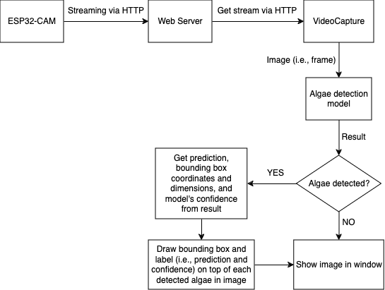</picture><br>
            <figcaption>System Design (ESP32-CAM)</figcaption>
         </figure><br><br>
         <figure>
            <picture></picture><br>
            <figcaption>System Design (iPhone)</figcaption>
         </figure><br><br>
         <figure>
            <picture>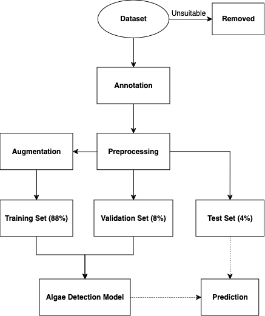</picture><br>
            <figcaption>Dataset Flowchart</figcaption>
         </figure><br><br>
         <figure>
            <picture></picture><br>
            <figcaption><a target="_blank" href="https://mmyolo.readthedocs.io/en/latest/recommended_topics/algorithm_descriptions/yolov8_description.html">YOLOv8 Architecture</a></figcaption>
         </figure><br><br>
         <figure>
            <picture>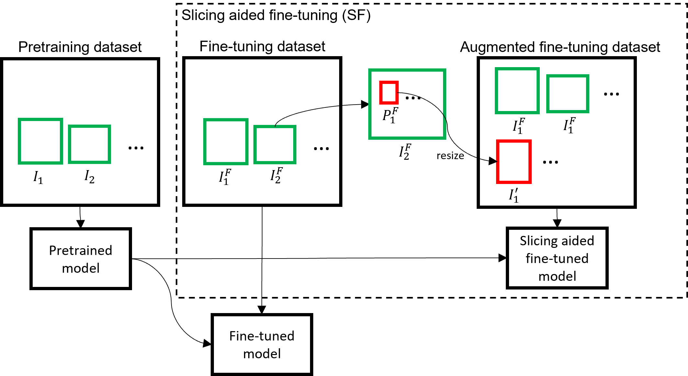</picture><br>
            <figcaption><a href="https://arxiv.org/abs/2202.06934" target="_blank">Slicing Aided Fine Tuning (SAFT) Framework</a></figcaption>
         </figure><br><br>
         <figure>
            <picture>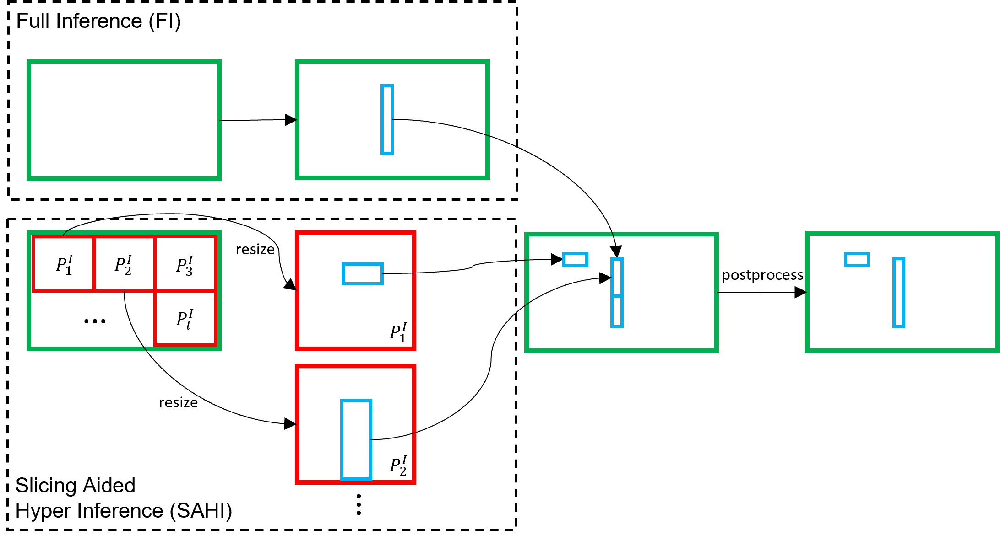</picture><br>
            <figcaption><a href="https://arxiv.org/abs/2202.06934" target="_blank">Slicing Aided Hyper Inference (SAHI) Framework</a></figcaption>
         </figure>
      </div>
</details>

<details>
   <summary><b>Models' Performance</b></summary>
   <table align="center" style="width: 100%; text-align: center; display: block; max-width: -moz-fit-content; max-width: fit-content; margin: 0 auto; overflow-x: auto; white-space: nowrap;">
      <tr>
         <th style="text-align: center;">[Pre-Trained] Model</th>
         <th style="text-align: center;">Confusion Matrix (Normalized)</th>
         <th style="text-align: center;">Precision-Confidence Curve</th>
         <th style="text-align: center;">Precision-Recall Curve</th>
         <th style="text-align: center;">Recall-Confidence Curve</th>
         <th style="text-align: center;">F1-Confidence Curve</th>
         <th style="text-align: center;">Training Results</th>
         <th style="text-align: center;">Validation Output</th>
         <th style="text-align: center;">Example Prediction</th>
      </tr>
      <tr>
         <td><a href="https://docs.ultralytics.com/models/yolov8">YOLOv8</a> Extra-Large</td>
         <td>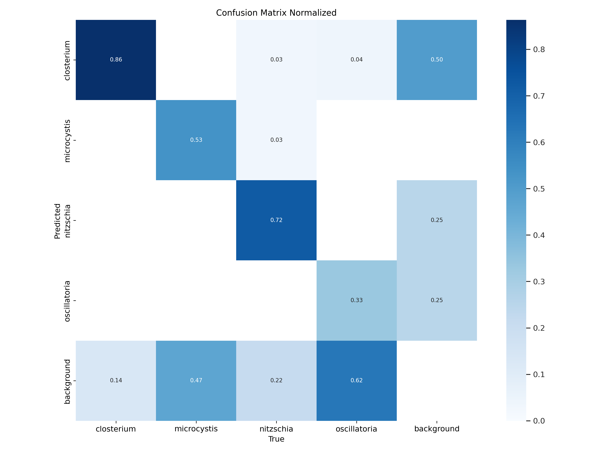</td>
         <td>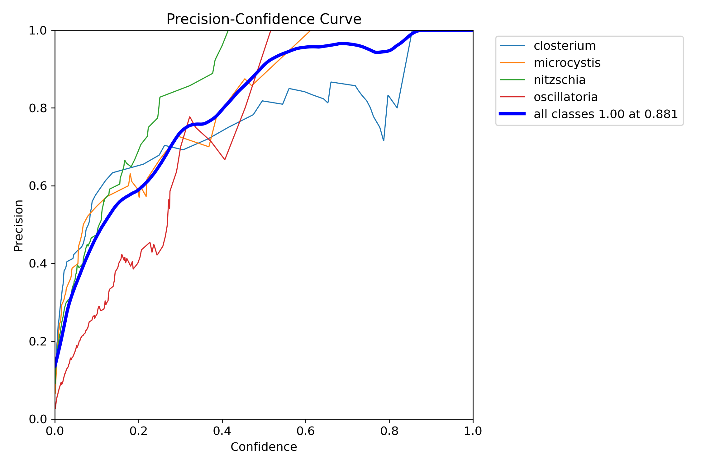</td>
         <td>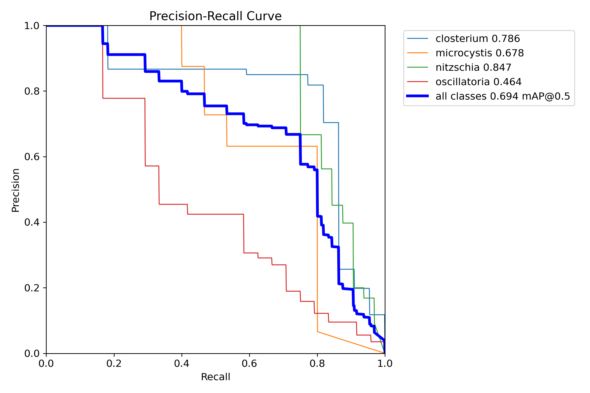</td>
         <td>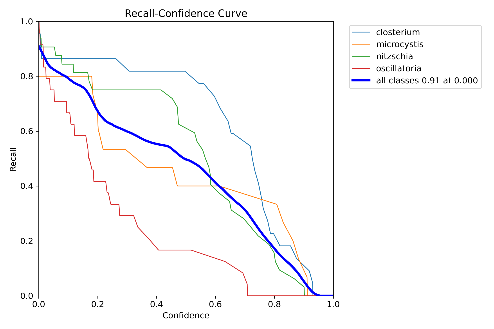</td>
         <td>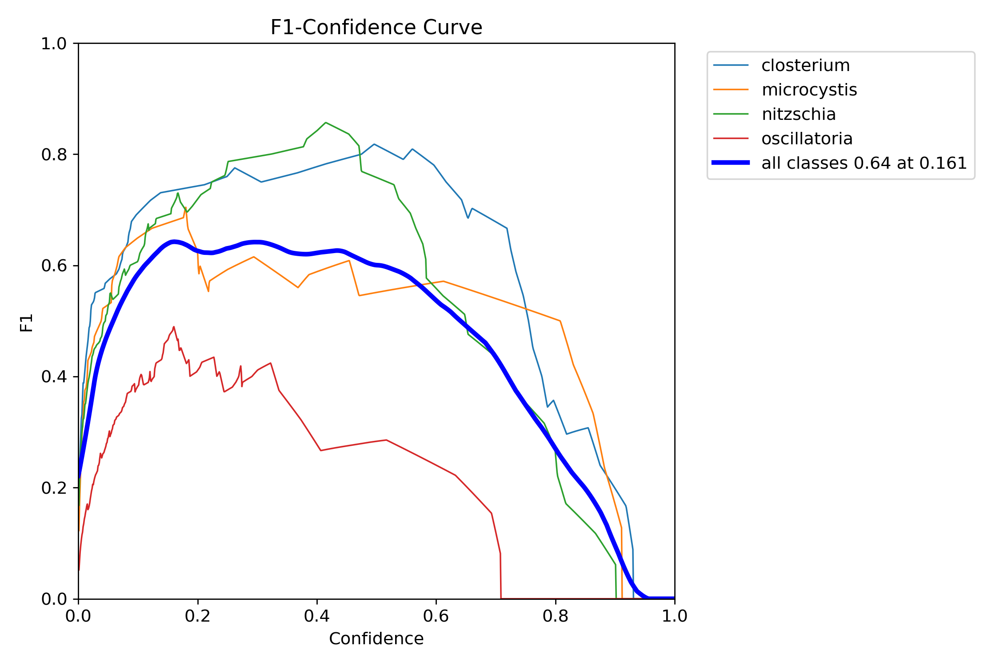</td>
         <td>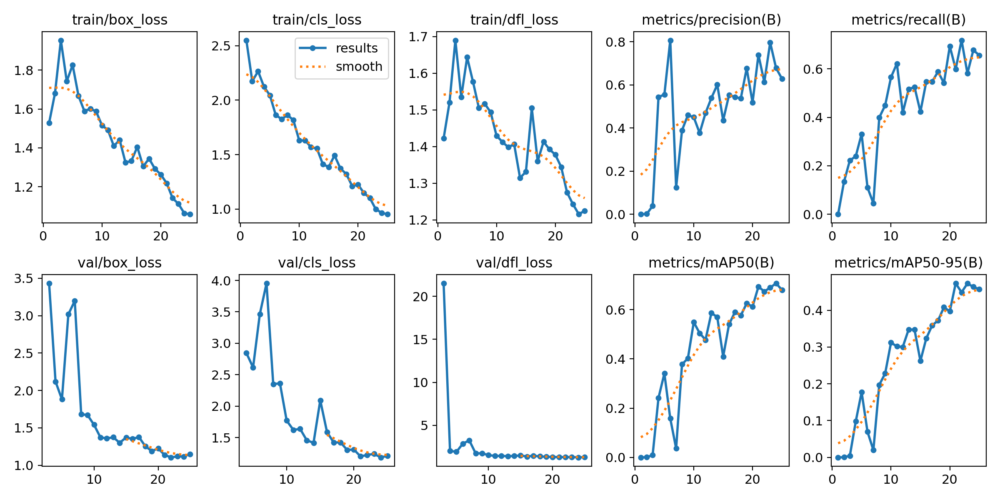</td>
         <td>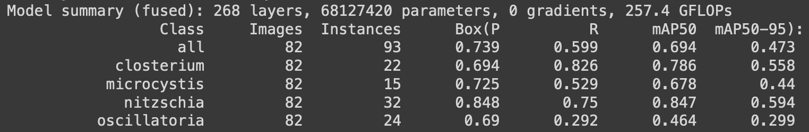</td>
         <td>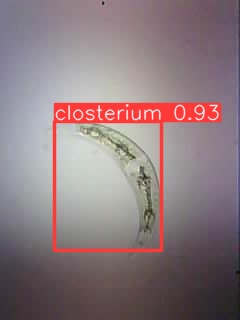</td>
      </tr>
      <tr>
         <td><a href="https://docs.ultralytics.com/models/yolov8">YOLOv8</a> Extra-Large v2</td>
         <td>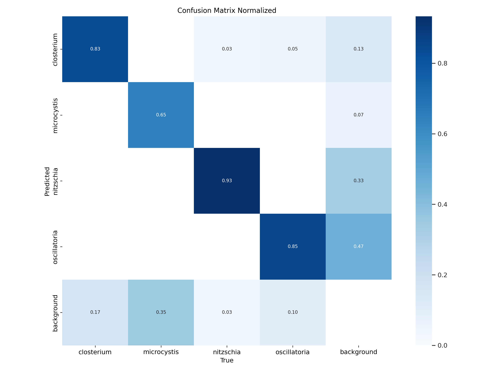</td>
         <td>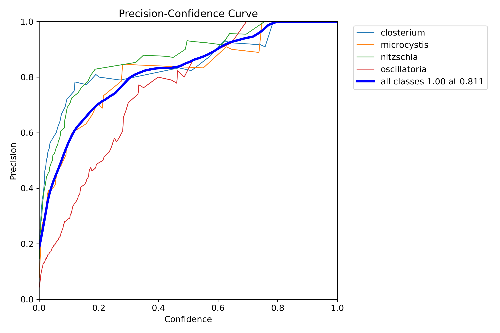</td>
         <td></td>
         <td></td>
         <td></td>
         <td></td>
         <td>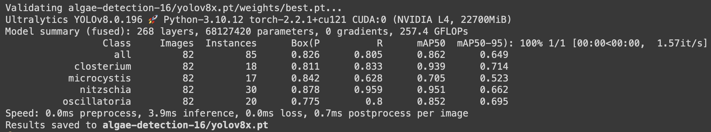</td>
         <td>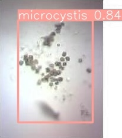</td>
      </tr>
      <tr>
         <td><a href="https://docs.ultralytics.com/models/yolov8">YOLOv8</a> Nano with <a href="https://docs.ultralytics.com/guides/sahi-tiled-inference">SAHI</a></td>
         <td></td>
         <td>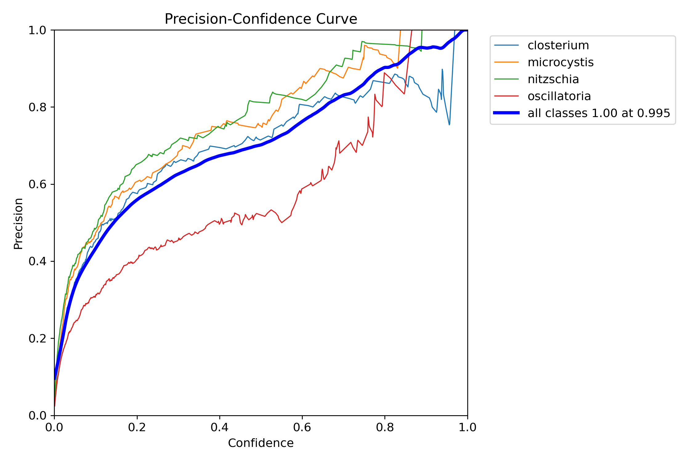</td>
         <td>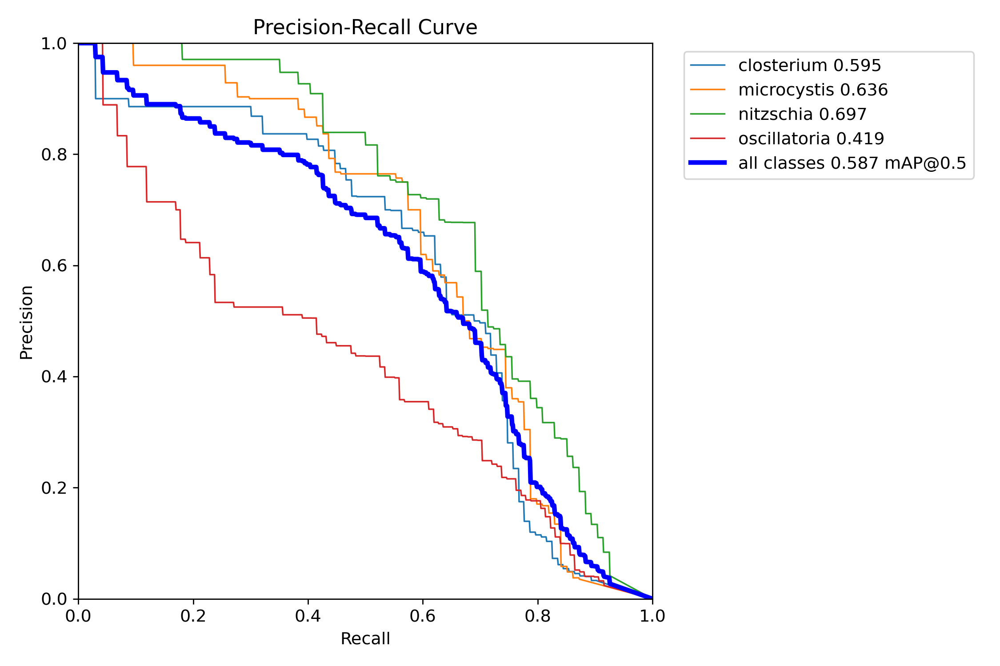</td>
         <td></td>
         <td>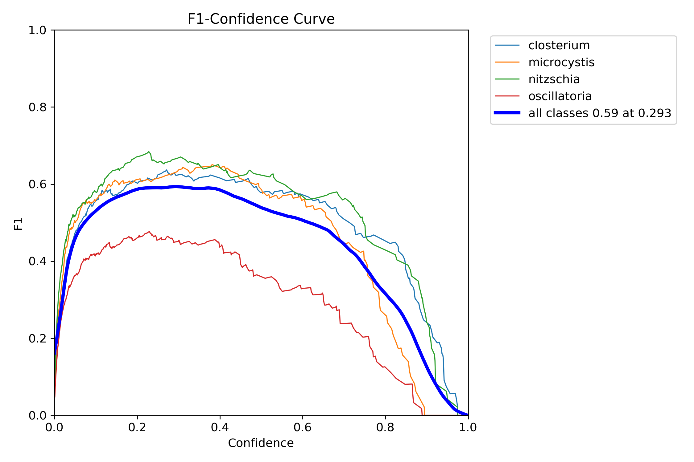</td>
         <td></td>
         <td>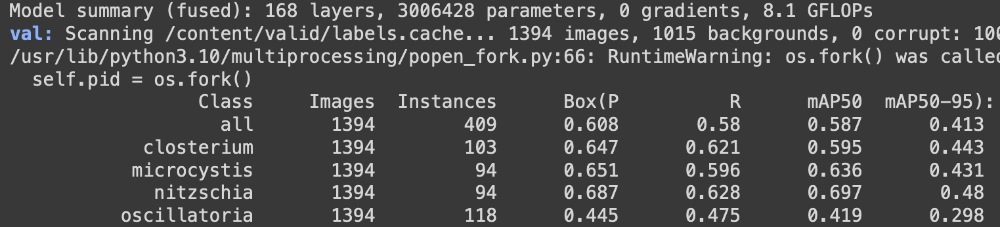</td>
         <td>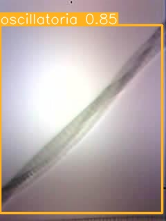</td>
      </tr>
   </table>
</details>

<details>
  <summary><b>Repository Structure</b></summary>
<pre>
.
├── documentation/
│   ├── installation_guide.md
│   ├── test_algae.pdf
│   └── user_manual.md
├── posters/
│   ├── cristian.pdf
│   ├── justin.pdf
│   └── kiran.pdf
├── presentation_slides/
│   └── algae_detection_ppt.pdf
├── src/
│   ├── assets/
│   │   ├── algae/
│   │   │   ├── closterium.jpg
│   │   │   ├── microcystis.jpg
│   │   │   ├── nitzschia.jpg
│   │   │   ├── non-algae.jpg
│   │   │   └── oscillatoria.jpg
│   │   ├── diagrams/
│   │   │   ├── dataset_flowchart.png
│   │   │   ├── esp32_sys_des.png
│   │   │   ├── iphone_sys_des.png
│   │   │   ├── saft_framework.png
│   │   │   ├── sahi_framework.png
│   │   │   └── yolov8_architecture.jpg
│   │   ├── esp32/
│   │   │   ├── ai_thinker.jpg
│   │   │   ├── ap_popup.png
│   │   │   ├── build_upload_monitor.png
│   │   │   ├── choose_ap.png
│   │   │   ├── config.png
│   │   │   ├── disconnect.png
│   │   │   ├── esp32_ip.png
│   │   │   ├── index.png
│   │   │   ├── init_config.png
│   │   │   ├── open_streaming.png
│   │   │   └── platformio_folder.png
│   │   ├── iphone/
│   │   │   ├── iphone_ui_connect.png
│   │   │   └── iphone_ui_disconnect.png
│   │   ├── models/
│   │   │   ├── custom_yolov8x/
│   │   │   │   ├── confusion_matrix_normalized.png
│   │   │   │   ├── confusion_matrix.png
│   │   │   │   ├── example.jpg
│   │   │   │   ├── F1_curve.png
│   │   │   │   ├── P_curve.png
│   │   │   │   ├── PR_curve.png
│   │   │   │   ├── R_curve.png
│   │   │   │   ├── results.png
│   │   │   │   └── validation.png
│   │   │   ├── custom_yolov8x_v2/
│   │   │   │   ├── confusion_matrix_normalized.png
│   │   │   │   ├── confusion_matrix.png
│   │   │   │   ├── example.jpg
│   │   │   │   ├── F1_curve.png
│   │   │   │   ├── P_curve.png
│   │   │   │   ├── PR_curve.png
│   │   │   │   ├── R_curve.png
│   │   │   │   ├── results.png
│   │   │   │   └── validation.png
│   │   │   └── sahi_yolov8n/
│   │   │       ├── confusion_matrix_normalized.png
│   │   │       ├── confusion_matrix.png
│   │   │       ├── example.jpg
│   │   │       ├── F1_curve.png
│   │   │       ├── P_curve.png
│   │   │       ├── PR_curve.png
│   │   │       ├── R_curve.png
│   │   │       ├── results.png
│   │   │       └── validation.png
│   │   ├── microscope.jpg
│   │   └── user_interface.png
│   ├── detection/
│   │   ├── base.py
│   │   ├── esp32.py
│   │   ├── iphone.py
│   │   └── webcam.py
│   └── streaming/
│       ├── boards/
│       │   ├── esp32cam_ai_thinker.json
│       │   ├── esp32cam_espressif_esp_eye.json
│       │   ├── esp32cam_espressif_esp32s2_cam_board.json
│       │   ├── esp32cam_espressif_esp32s2_cam_header.json
│       │   ├── esp32cam_espressif_esp32s3_cam_lcd.json
│       │   ├── esp32cam_espressif_esp32s3_eye.json
│       │   ├── esp32cam_freenove_s3_wroom_n8r8.json
│       │   ├── esp32cam_freenove_wrover_kit.json
│       │   ├── esp32cam_m5stack_camera_psram.json
│       │   ├── esp32cam_m5stack_camera.json
│       │   ├── esp32cam_m5stack_esp32cam.json
│       │   ├── esp32cam_m5stack_unitcam.json
│       │   ├── esp32cam_m5stack_unitcams3.json
│       │   ├── esp32cam_m5stack_wide.json
│       │   ├── esp32cam_seeed_xiao_esp32s3_sense.json
│       │   ├── esp32cam_ttgo_t_camera.json
│       │   └── esp32cam_ttgo_t_journal.json
│       ├── html/
│       │   ├── index.html
│       │   └── index.min.html
│       ├── include/
│       │   ├── format_duration.h
│       │   ├── format_number.h
│       │   ├── lookup_camera_effect.h
│       │   ├── lookup_camera_frame_size.h
│       │   ├── lookup_camera_gainceiling.h
│       │   ├── lookup_camera_wb_mode.h
│       │   └── settings.h
│       ├── lib/
│       │   └── rtsp_server/
│       │       ├── library.json
│       │       ├── rtsp_server.cpp
│       │       └── rtsp_server.h
│       ├── src/
│       │   └── main.cpp
│       ├── generate_html.ps1
│       ├── generate_html.sh
│       ├── minify.py
│       └── platformio.ini
├── videos/
│   └── index.html
├── weights/
│   ├── custom_yolov8x_v2.pt.zip
│   ├── custom_yolov8x.pt.zip
│   └── yolov8n_sahi.pt.zip
├── .gitattributes
├── .gitignore
├── environment.yml
└── README.md
</pre>
</details>

## Requirements
<details>
   <summary><b>ESP32-CAM (or similar)</b></summary>
      <ul>
         <li>AI Thinker</li>
         <li>Espressif ESP-EYE</li>
         <li>Espressif ESP32S2-CAM</li>
         <li>Espressif ESP32S3-CAM-LCD</li>
         <li>Espressif ESP32S3-EYE</li>
         <li>Freenove ESP32-WROVER</li>
         <li>M5Stack</li>
         <li>M5Stack ESP32CAM</li>
         <li>M5Stack PSRAM</li>
         <li>M5Stack Unit Cam</li>
         <li>M5Stack Unit CamS3</li>
         <li>M5Stack PSRAM</li>
         <li>M5Stack PSRAM 2.0</li>
         <li>M5Stack WIDE</li>
         <li>Seeed Studio XIAO ESP32S3 Sense</li>
         <li>TTGO T-Camera</li>
         <li>TTGO T-Journal</li>
      </ul>
</details>

- [x] Nikon microscope with 3D printed lens attachment and illuminator
- [x] Micro-USB cable
- [x] [Algae dataset](https://drive.google.com/drive/folders/1gd85o6dpcjDwWJUUi4x9slhjHHuoY4K0)
- [x] [Visual Studio Code](https://code.visualstudio.com/download)
- [x] [PlatformIO plugin for Visual Studio Code](https://platformio.org/install/ide?install=vscode)
- [x] [Roboflow account](https://roboflow.com)
- [x] [Google Colab account](https://accounts.google.com/ServiceLogin?passive=true&continue=https%3A%2F%2Fcolab.research.google.com)
- [x] [Anaconda](https://docs.continuum.io/free/anaconda/install) **OR** [Miniconda](https://docs.conda.io/projects/miniconda/en/latest)

> [!TIP]
> If you have trouble deciding between Anaconda and Miniconda, please refer to the table below:
> <table>
> <thead>
> <tr>
> <th><center>Anaconda</center></th>
> <th><center>Miniconda</center></th>
> </tr>
> </thead>
> <tbody>
> <tr>
> <td>New to conda and/or Python</td>
> <td>Familiar with conda and/or Python</td>
> </tr>
> <tr>
> <td>Like the convenience of having Python and 1,500+ scientific packages automatically installed at once</td>
> <td>Want fast access to Python and the conda commands and plan to sort out the other programs later</td>
> </tr>
> <tr>
> <td>Have the time and space (a few minutes and 3 GB)</td>
> <td>Don't have the time or space to install 1,500+ packages</td>
> </tr>
> <tr>
> <td>Don't want to individually install each package</td>
> <td>Don't mind individually installing each package</td>
> </tr>
> </tbody>
> </table>

## Installation
1. Verify that conda is installed
   ```
   conda --version
   ```
2. Ensure conda is up to date
   ```
   conda update conda
   ```
3. Enter the directory you want `algae-detection` to be cloned in
     * POSIX
       ```sh
       cd ~/path/to/directory
       ```
     * Windows
       ```sh
       cd C:\Users\user\path\to\directory
       ```
4. Clone `algae-detection`
   ```sh
   git clone https://github.com/lynkos/algae-detection.git && cd algae-detection
   ```

> [!WARNING]
> Due to the [large] size of the repo, you may get errors such as:
> 
> <pre>error: RPC failed; curl 56 Recv failure: Connection reset by peer error: 6022 bytes of body are still expected fetch-pack: unexpected disconnect while reading sideband packet fatal: early EOF fatal: fetch-pack: invalid index-pack output</pre>
>
> If this is the case, please download [Git LFS](https://git-lfs.com) and try cloning again. If you're still getting errors, consider [cloning via SSH](https://github.com/git-guides/git-clone#git-clone-with-ssh) (`git clone git@github.com:lynkos/algae-detection.git`) or [manually downloading the repo as a `.zip` file](https://github.com/lynkos/algae-detection/archive/refs/heads/main.zip) and decompressing it.

5. Create conda virtual environment from [`environment.yml`](environment.yml)
   ```
   conda env create -f environment.yml
   ```
6. Activate `algae_env`
   ```
   conda activate algae_env
   ```
7. Confirm that `algae_env` is active
     * If active, `algae_env` should be in parentheses () or brackets [] before your command prompt, e.g.
       ```
       (algae_env) $
       ```
     * If necessary, see which virtual environments are available and/or currently active (active environment denoted with asterisk (*))
       ```
       conda info --envs
       ```
       **OR**
       ```
       conda env list
       ```

## Usage
### Detect and Classify Algae
<details open>
   <summary><b>User Interface</b></summary>
   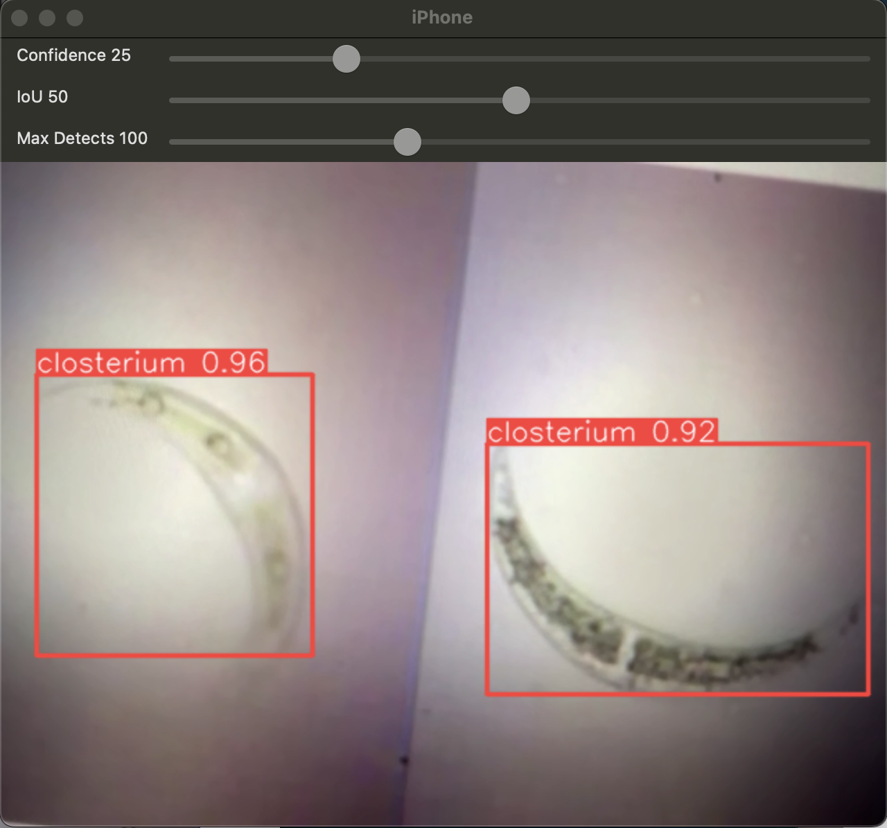
</details>

1. Open [`weights`](weights)
2. Choose the algae detection model you want to use

> [!TIP]
> To use your own `.pt` model, add it to [`weights`](weights).
>
> To use an existing model, decompress the `.zip` file to get the `.pt` model.
> * [YOLOv8](https://docs.ultralytics.com/models/yolov8) Nano with [SAHI](https://docs.ultralytics.com/guides/sahi-tiled-inference): [`yolov8n_sahi.pt.zip`](weights/yolov8n_sahi.pt.zip)
> * [YOLOv8](https://docs.ultralytics.com/models/yolov8) Extra-Large: [`custom_yolov8x.pt.zip`](weights/custom_yolov8x.pt.zip), [`custom_yolov8x_v2.pt.zip`](weights/custom_yolov8x_v2.pt.zip)

3. Open [`base.py`](src/detection/base.py)
4. Set [`MODEL_PATH`](src/detection/base.py#L22) to path of desired `.pt` model
5. Read the following depending on which camera you'll use
   * [ESP32](#esp32)
   * [iPhone](#iphone)
   * [Webcam](#webcam)

#### ESP32
> [!IMPORTANT]
> Current implementation of ESP32-CAM requires WiFi!
>
> Unfortunately, WiFi connections from hotspots or SSOs are not compatible.

1. Click the PlatformIO icon in the activity bar, then click 'Pick a folder'<br>
   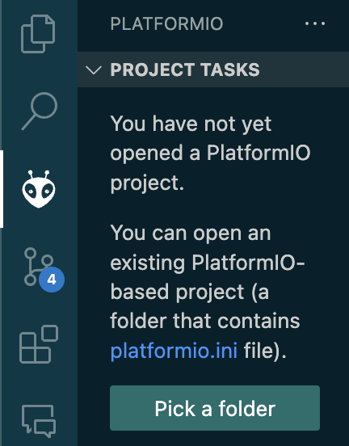
2. Open [`streaming`](src/streaming)<br>
   
3. Make sure the ESP32 is connected to the computer
4. Build and upload code to ESP32
   - Click 'Build' to compile code
   - Click 'Upload' to flash code to ESP32<br>
   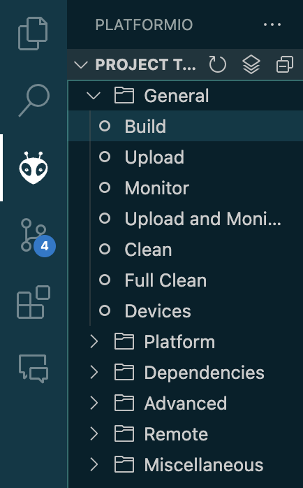
5. To connect initially to the device, connect to the WiFi network starting with `ESP32CAM-RTSP`<br>
   
6. Click 'Change settings' once the browser automatically opens the home page ([`http://192.168.4.1`](http://192.168.4.1))

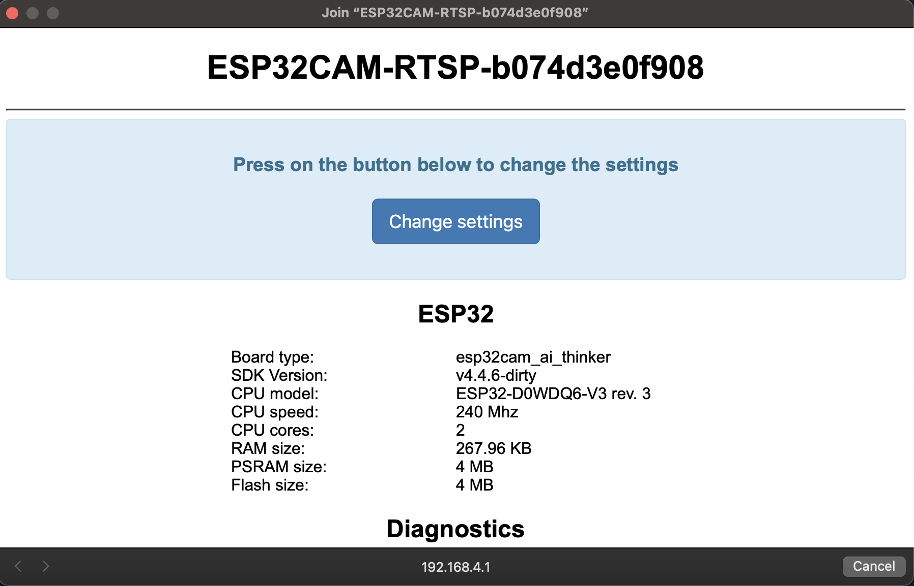

7. You **must** fill in all of the following fields:
   - AP (i.e., Access Point) password
   - WiFi SSID
   - WiFi password (if applicable)

> [!NOTE]
> If you ever lose/forget the AP password, click 'Erase flash' (in PlatformIO's extension UI) to erase and reset the device, then follow steps 4 and onwards again.


8. Update the streaming server settings and configure camera options (you can always change them later)

> [!WARNING]
> Very low number for 'JPG quality' (i.e., very high quality) may cause the ESP32 to crash or return no image!

   <details>
      <summary><b>Camera Settings</b></summary>
      <div align="center">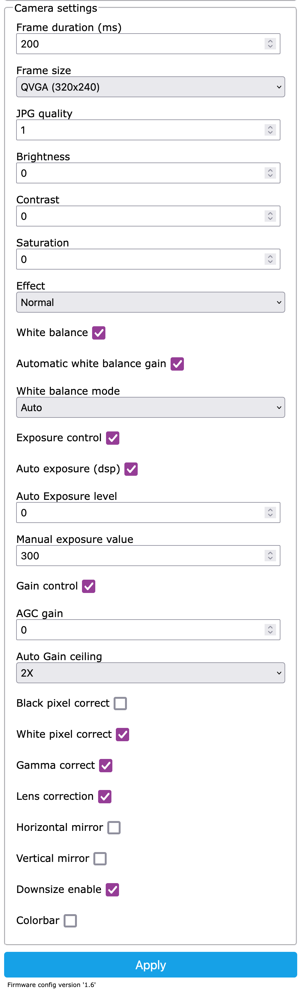</div>
   </details>

9. Scroll down and click 'Apply' to save settings

> [!IMPORTANT]
> You must reset the device in order for the settings to take effect.

10. Disconnect from the current network and reconnect to your WiFi in order to reset ESP32 and connect to the AP

> [!NOTE]
> If the error screen says it's unable to make a connection, try rebooting the ESP32 first (you can do so manually by pressing the 'Reset' button). It'll wait 30 seconds for a connection (configurable).
>
> Connect to the SSID, go to the ESP32's IP address and, anytime you're prompted for credentials, enter `admin` as the username and the AP password for the password.

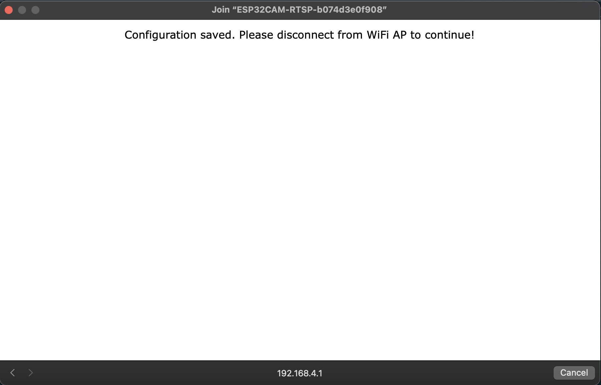

11. Go back to PlatformIO's VSCode extension and click 'Monitor', then search for the ESP32's IP address

> [!TIP]
> To quickly find the IP address:
> - PC
>   ```
>   Ctrl + F
>   ```
> - Mac
>   ```
>   ⌘ + F
>   ```
>
> Then type 'IP Address' in the search bar and press 'Enter'.


12. You can now stream from the ESP32
   - HTTP Motion JPEG Streamer: `http://<ESP32 IP address>/stream`
   - HTTP Image: `http://<ESP32 IP address>/snapshot`
   - RTSP: `rtsp://<ESP32 IP address>:554/mjpeg/1`

> [!CAUTION]
> Anyone with network access to the device can see the streams and images!

   <details>
      <summary><b>Home Page</b></summary>
      <div align="center">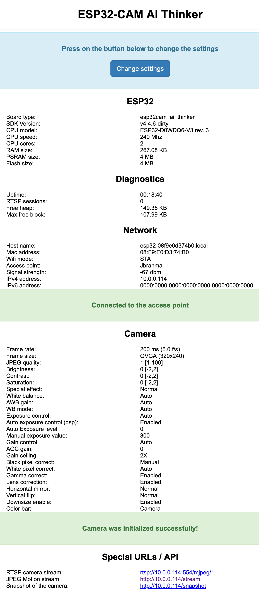</div>
   </details>

13. Open [`esp32.py`](src/detection/esp32.py) once finished
14. Set [`URL`](src/detection/esp32.py#L3) to ESP32's IP address (i.e., `http://10.0.0.111` in this example)
15. Run [`esp32.py`](src/detection/esp32.py)
   * POSIX
      ```sh
      $(which python) src/detection/esp32.py
      ```
   * Windows
      ```sh
      $(where python) src\detection\esp32.py
      ```

> [!NOTE]
> See [this module's](https://github.com/rzeldent/esp32cam-rtsp) [`README.md`](https://github.com/rzeldent/esp32cam-rtsp/blob/main/README.md) for further details on streaming.
>
> To update to latest version, commit and push changes, then run the following command in the terminal:
> <pre>git subtree pull --prefix src/streaming https://github.com/rzeldent/esp32cam-rtsp.git develop --squash</pre>

#### iPhone
1. Open [`iphone.py`](src/detection/iphone.py)
2. Run [`iphone.py`](src/detection/iphone.py)
   * POSIX
      ```sh
      $(which python) src/detection/iphone.py
      ```
   * Windows
      ```sh
      $(where python) src\detection\iphone.py
      ```
3. If successfully connected, your iPhone's screen should look like this:<br>
   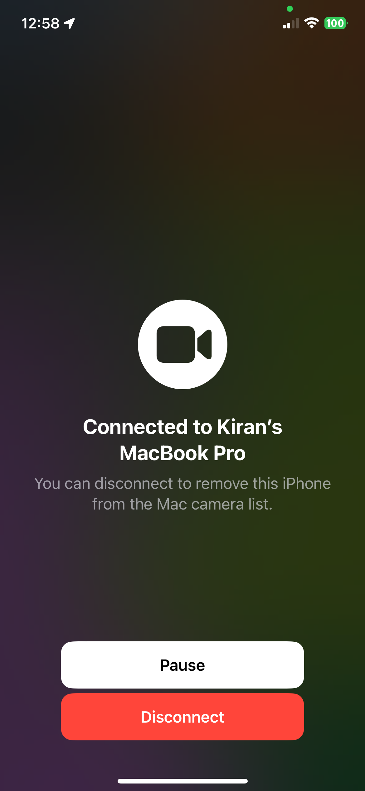
4. Press `q` on your computer or 'Disconnect' on your iPhone to exit the program<br>
   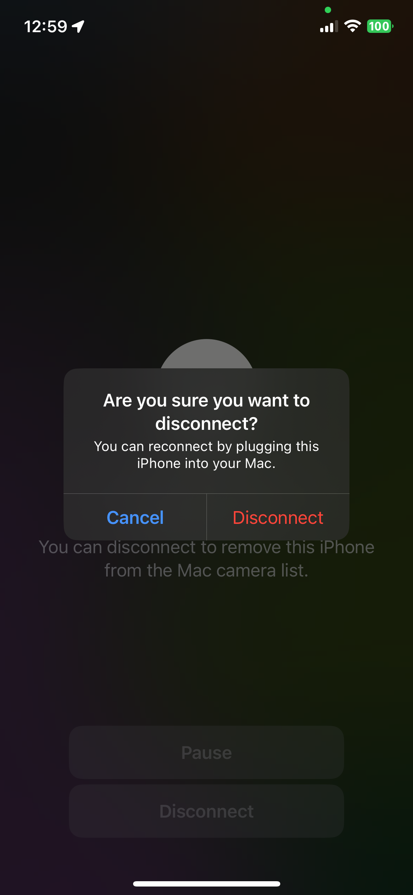

#### Webcam
1. Open [`webcam.py`](src/detection/webcam.py)
2. Run [`webcam.py`](src/detection/webcam.py)
   * POSIX
      ```sh
      $(which python) src/detection/webcam.py
      ```
   * Windows
      ```sh
      $(where python) src\detection\webcam.py
      ```

### Training, Validating, and Testing Model
1. Visit [this Google Colab notebook](https://colab.research.google.com/drive/19X4aGWTeXQbgEKVteR9qrgit67jNxkmJ)
2. Follow the notebook's instructions
3. Run notebook

## Future Work
- [ ] Increase dataset and improve model accuracy and versatility by taking quality images of various types of algae
   - At least [1000 images per class](https://blog.roboflow.com/model-best-practices/#dataset-size) 
   - [All classes are balanced](https://blog.roboflow.com/handling-unbalanced-classes) (i.e., have roughly the same amount of images)
   - [Dr. Schonna R. Manning](https://case.fiu.edu/about/directory/profiles/manning-schonna-r..html) may help with categorizing any algae in new images
- [ ] Connect to ESP32 without a web server (e.g., via USB, etc.), just like Webcam and iPhone OR use RTSP instead of HTTP
- [ ] Heatsink for ESP32 to prevent overheating
- [ ] Use DC-GAN to generate additional synthetic images for training
- [ ] Try different models, such as [RetinaNet](https://paperswithcode.com/method/retinanet) and [YOLOv9](https://docs.ultralytics.com/models/yolov9)
- [ ] Run model on ESP32 rather than on computer
- [ ] Update microscope's 3D printed lens attachment by making it adjustable **AND/OR** create multiple ones for different devices, e.g., iPhone, Android, etc.
- [ ] Add Android compatability (if applicable and/or necessary)

## Further Reading
- [USGS Finds 28 Types of Cyanobacteria in Florida Algal Bloom](https://www.usgs.gov/news/national-news-release/usgs-finds-28-types-cyanobacteria-florida-algal-bloom)
- [Cyanobacteria (Blue-Green Algae)](https://myfwc.com/research/wildlife/health/cyanobacteria/#:~:text=Approximately%2020%20cyanobacteria%20species%20in,than%20one%20type%20of%20toxin)
- [Cyanobacteria of the 2016 Lake Okeechobee and Okeechobee Waterway Harmful Algal Bloom](https://pubs.usgs.gov/publication/ofr20171054)
- [Computer Vision Based Deep Learning Approach for the Detection and Classification of Algae Species Using Microscopic Images](https://www.mdpi.com/2073-4441/14/14/2219)
- Research "[toxic cyanobacteria](https://www.google.com/search?q=toxic+cyanobacteria)"

## Credits
Special thanks to:
- [Dr. Antao Chen](https://ieeexplore.ieee.org/author/37291140300) (product owner) for his mentorship
- [rdgbrian](https://github.com/rdgbrian) (team lead during Fall 2023) for his assistance
- [rzeldent](https://github.com/rzeldent) for [ESP32CAM-RTSP](https://github.com/rzeldent/esp32cam-rtsp/tree/develop), which has been slightly modified and added as a git subtree in [`streaming`](src/streaming)
