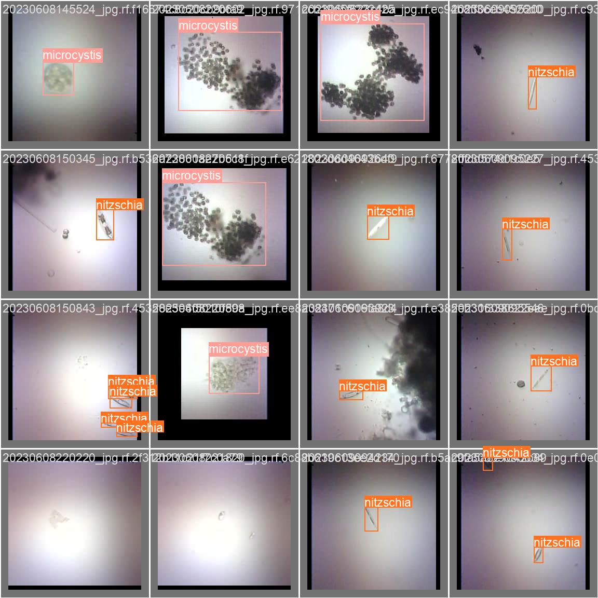

<div align="center">
<h1>Using AI and Low-Cost Camera to Detect Harmful Algae</h1>


<br>


<br>


<br><br>
<a target="_blank" href="https://universe.roboflow.com/capstone2algae/algae-detection-1opyx/model"></a>
<a target="_blank" href="https://colab.research.google.com/drive/19X4aGWTeXQbgEKVteR9qrgit67jNxkmJ"></a>
</div>

## Overview
This project aims to provide a practical, convenient, and efficient tool to monitor water quality and mitigate / prevent harmful algal blooms in real-time by:
- [x] Fine-tuning pre-trained AI models to detect harmful algae
- [x] Leveraging the portability of smartphones and low-cost cameras
   - Tested with [ESP32-CAM AI Thinker](https://docs.ai-thinker.com/en/esp32-cam) and [ESP32-S3-EYE](https://www.espressif.com/en/products/devkits/esp-eye/overview), but compatible with a large variety of other boards/SoCs
   - See '[Boards](appendix.md#boards)' section in [`appendix.md`](appendix.md) for full list of compatible cameras

Since it's designed to be user-friendly and cost-effective, it's also suitable for educational and research purposes.

<details open>
   <summary>Project Demo</summary>

   <div align="center">
      <figure>
         <picture></picture><br>
         <figcaption style="font-size: 11px;">Detected algae are annotated with a bounding box, predicted class/category, and the AI model's confidence in its prediction(s). Trackbars allow user to configure the AI model's attributes — Confidence, IoU (i.e., Intersection over Union), and Max Detections — in real time.</figcaption>
      </figure>
   </div>
</details>

<details open>
   <summary><a href="../weights/custom_yolov8n.pt"><code>custom_yolov8n.pt</code></a> (i.e., custom AI model) validation results</summary>
   
   <div align="center">
      <table style="width: 100%; text-align: center;">
         <tr>
            <th style="text-align: center;">Predict</th>
            <th style="text-align: center;">Correct</th>
        </tr>
        <tr>
            <td></td>
            <td></td>
        </tr>
    </table>
   <p style="font-size: 11px;">Though it may appear so, these aren't duplicates! The left image shows what the model detected, while the right image shows the correct labels. The original images are from one of the batches in the model's validation dataset.</p>
   </div>
</details>

<details open>
   <summary>Hardware: Nikon microscope with ESP32-CAM AI Thinker and illuminator</summary>

   <div align="center">
      <figure>
         <picture></picture><br>
         <figcaption style="font-size: 11px;">ESP32-CAM AI Thinker inside a custom 3D printed lens attachment atop the microscope's eyepiece.</figcaption>
      </figure>
   </div>
</details>

## Requirements
> [!IMPORTANT]
> <a target="_blank" href="https://docs.conda.io/en/latest">Conda</a> is technically the only hard requirement, though by itself provides a barebones experience and doesn't show the program's full functionality.
> 
> Refer to [Customization](appendix.md#customization) in [`appendix.md`](appendix.md) if you don't want to or can't use a(n) ESP32-CAM and/or microscope.

- [ ] Any of the [boards](appendix.md#boards) listed in [`appendix.md`](appendix.md)
- [ ] Nikon microscope with 3D printed lens attachment and illuminator
- [ ] Micro-USB cable (to connect board to computer)
- [ ] <a target="_blank" href="https://roboflow.com">Roboflow account</a>
- [ ] Dataset
   * <a target="_blank" href="https://drive.google.com/drive/folders/1gd85o6dpcjDwWJUUi4x9slhjHHuoY4K0">Google Drive</a>: Original and unedited
   * <a target="_blank" href="https://universe.roboflow.com/capstone2algae/algae-detection-1opyx/dataset">Roboflow</a>: Includes annotations, pre-processing, and augmentation
- [ ] <a target="_blank" href="https://code.visualstudio.com/download">Visual Studio Code</a>
- [ ] <a target="_blank" href="https://platformio.org/install/ide?install=vscode">PlatformIO plugin for Visual Studio Code</a>
- [ ] <a target="_blank" href="https://accounts.google.com/ServiceLogin?passive=true&continue=https%3A%2F%2Fcolab.research.google.com">Google Colab account</a>
- [x] <a target="_blank" href="https://docs.continuum.io/free/anaconda/install">Anaconda</a> **OR** <a target="_blank" href="https://docs.conda.io/projects/miniconda/en/latest">Miniconda</a>

> [!TIP]
> If you have trouble deciding between Anaconda and Miniconda, please refer to the table below:
> <table>
>  <thead>
>   <tr>
>    <th><center>Anaconda</center></th>
>    <th><center>Miniconda</center></th>
>   </tr>
>  </thead>
>  <tbody>
>   <tr>
>    <td>New to conda and/or Python</td>
>    <td>Familiar with conda and/or Python</td>
>   </tr>
>   <tr>
>    <td>Not familiar with using terminal and prefer GUI</td>
>    <td>Comfortable using terminal</td>
>   </tr>
>   <tr>
>    <td>Like the convenience of having Python and 1,500+ scientific packages automatically installed at once</td>
>    <td>Want fast access to Python and the conda commands and plan to sort out the other programs later</td>
>   </tr>
>   <tr>
>    <td>Have the time and space (a few minutes and 3 GB)</td>
>    <td>Don't have the time or space to install 1,500+ packages</td>
>   </tr>
>   <tr>
>    <td>Don't want to individually install each package</td>
>    <td>Don't mind individually installing each package</td>
>   </tr>
>  </tbody>
> </table>
>
> Typing out entire Conda commands can sometimes be tedious, so I wrote a shell script ([`conda_shortcuts.sh` on GitHub Gist](https://gist.github.com/lynkos/7a4ce7f9e38bb56174360648461a3dc8)) to define shortcuts for commonly used Conda commands.
> <details>
>   <summary>Example: Delete/remove a conda environment named <code>test_env</code></summary>
>
> * Shortcut command
>     ```
>     rmenv test_env
>     ```
> * Manually typing out the entire command
>     ```sh
>     conda env remove -n test_env && rm -rf $(conda info --base)/envs/test_env
>     ```
>
> The shortcut has 80.8% fewer characters!
> </details>

## Installation
1. Verify that conda is installed
   ```
   conda --version
   ```

2. Ensure conda is up to date
   ```
   conda update conda
   ```

3. Enter the directory you want `algae-detection` to be cloned in
   * POSIX
      ```sh
      cd ~/path/to/directory
      ```
   * Windows
      ```sh
      cd C:\Users\user\path\to\directory
      ```

4. Clone and enter `algae-detection`
   ```sh
   git clone https://github.com/lynkos/algae-detection.git && cd algae-detection
   ```

5. Create virtual environment from [`environment.yml`](../environment.yml)
   ```sh
   conda env create -f environment.yml
   ```

## Quick Start
<ol>
   <li>Activate <code>algae_env</code> (i.e., virtual environment)<pre>conda activate algae_env</pre></li>
   <li>Confirm <code>algae_env</code> is active
      <ul>
        <li><code>algae_env</code> should be in parentheses () or brackets [] before your command prompt, e.g.<pre>(algae_env) $</pre></li>
        <li>See which virtual environments are available and/or currently active (active environment denoted with asterisk (*))<pre>conda info --envs</pre> <b>OR</b> <pre>conda env list</pre></li>
      </ul>
   </li>
   <li id="s3">Run <a href="../src/detection/camera.py"><code>camera.py</code></a></li>
</ol>

> [!IMPORTANT]
> Automatically uses computer's default camera (i.e., webcam). To use different cameras:
> 
> * **ESP32-CAM**
>    * Refer to [ESP32-CAM tutorial](manual.md#esp32-cam) in [`manual.md`](manual.md)
> * **iPhone**
>     * Requires macOS v13+ and iOS v16+ (see [Apple's user guide](https://support.apple.com/guide/mac-help/use-iphone-as-a-webcam-mchl77879b8a/mac) for further details)
>     * Connect iPhone to Mac via USB before following [Step #3](#s3)
>     * Run [`camera.py`](../src/detection/camera.py) with argument `--cam 1`
>     * <details><summary>Connected iPhone</summary><div align="center"></div></details>
> 
> <details>
>   <summary>User Interface</summary>
>
>   <div align="center">
>    <figure>
>    <picture></picture><br>
>    <figcaption style="font-size: 11px;">Users can view live footage from the camera. Detected algae are annotated with a bounding box, predicted class/category, and the model's confidence. Trackbars allow user to configure detection model attributes in real time.</figcaption>
>    </figure>
>   </div>
> </details>
>
> See [Command Line Arguments table](manual.md#command-line-arguments) in [`manual.md`](manual.md) for all possible arguments!

   <ul>
      <li>POSIX<br><pre>python src/detection/camera.py</pre></li>
      <li>Windows<br><pre>python src\detection\camera.py</pre></li>
   </ul>
</p>

<ol start="4">
   <li>Press the 'Escape' key on your keyboard to terminate</li>
</ol>

## Additional Information
- <a target="_blank" href="https://github.com/rzeldent/esp32cam-rtsp/tree/develop">ESP32CAM-RTSP</a> ([credit: rzeldent](#credits))

### [Appendix](appendix.md)
- [Boards](appendix.md#boards)
- [Diagrams](appendix.md#diagrams)
- [Customization](appendix.md#customization)
  - [Custom Dataset](appendix.md#custom-dataset)
  - [ESP32-CAM](appendix.md#esp32-cam)
- [Inference Deployed Model](appendix.md#inference-deployed-model)
- [Future Work](appendix.md#future-work)
- [Further Reading](appendix.md#further-reading)
- [Glossary](appendix.md#glossary)

### [Manual](manual.md)
- [Command Line Arguments](manual.md#command-line-arguments)
- [ESP32-CAM](manual.md#esp32-cam)
  - [Initial Setup](manual.md#initial-setup)
  - [Usage](manual.md#usage)
- [Train, Validate, and Test Model](manual.md#train-validate-and-test-model)
- [Select Model](manual.md#select-model)
  
## Credits
Special thanks to:
- <a target="_blank" href="https://ieeexplore.ieee.org/author/37291140300">Dr. Antao Chen</a> (product owner) for his mentorship
- <a target="_blank" href="https://github.com/rdgbrian">rdgbrian</a> (Fall 2023 team lead) for his assistance
- <a target="_blank" href="https://github.com/rzeldent">rzeldent</a> for <a target="_blank" href="https://github.com/rzeldent/esp32cam-rtsp/tree/develop">ESP32CAM-RTSP</a>, which has been slightly modified and added as a git subtree in [`streaming`](../src/streaming)
