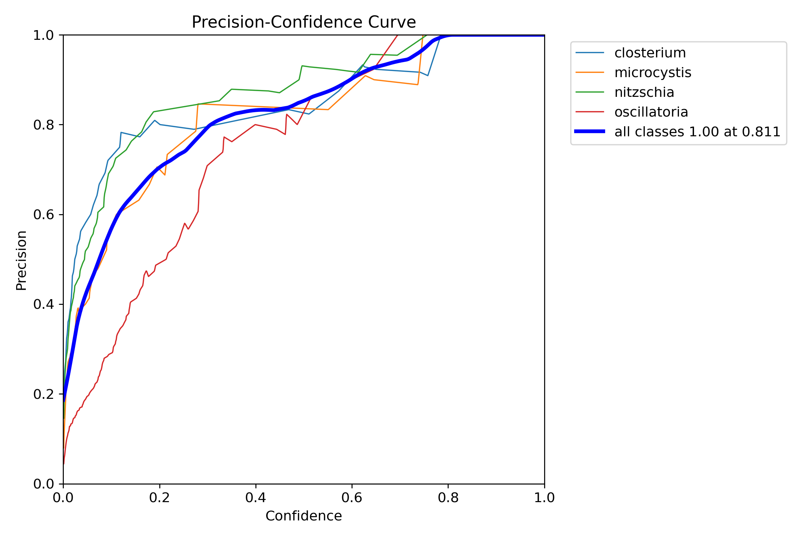
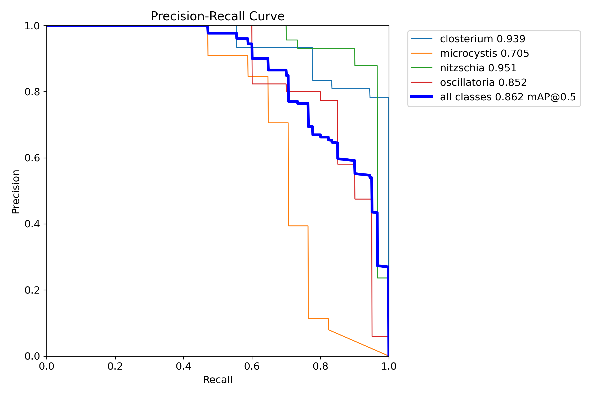
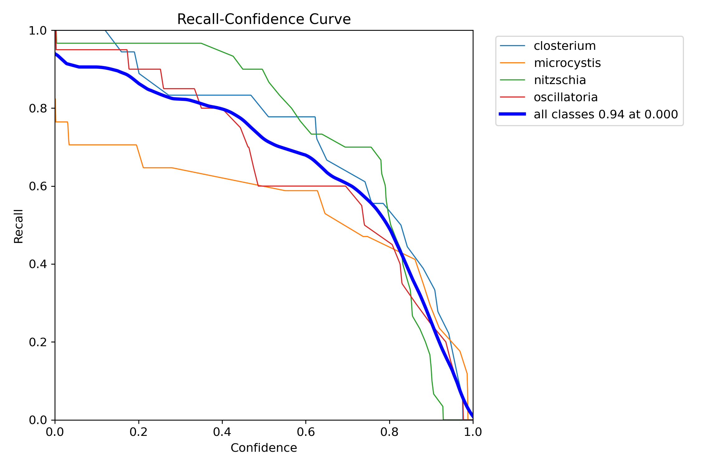
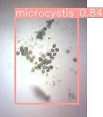
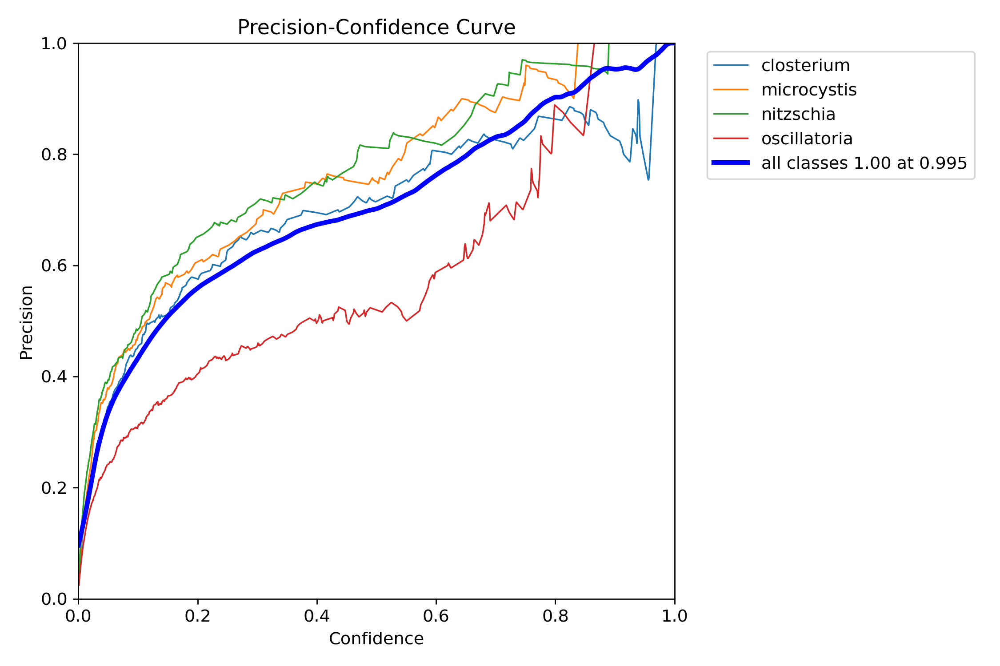
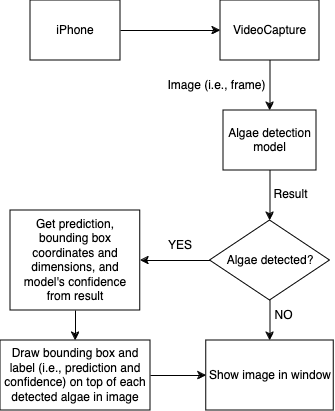

# Appendix
<details open>
  <summary>Background</summary>

  Algal blooms (e.g., <a href="#red_tide">Red Tide</a>) pose a threat to the health of humans, marine life, and [aquatic] ecosystems. These blooms, often fueled by nutrient runoff and warmer temperatures, are increasing in prevalence and can negatively impact water quality and oxygen levels, hence the need to keep track of harmful [algae](#algae) / algal blooms (i.e., collect natural water sample(s) for analysis).

  An expensive and cumbersome microscope is often needed to view samples/slides in high-resolution. While offering very high visual fidelity, these types of microscopes do not offer a solution that can be used in the field. Conversely, affordable and light microscopes come with limitations as well, such as subpar resolution and focus. The manual nature of detection, quantification, and classification further compounds the drawbacks, resulting in time-consuming and labor-intensive procedures.

  Although it certainly isn't a 1 : 1 comparison, I like to think of the camera(s) as the system's eyes and the detection model as its brain:
    - This project applies [computer vision](#cv) (subfield of [AI](#ai)) techniques to fetch visual data from the camera(s)
    - The type of model being used (i.e., [CNN](#cnn), which is a subset of [DNN](#dnn)) is loosely inspired by the human brain
    - In both cases, eyes / camera(s) see / get the input and send it to the brain / model for processing
</details>

## Boards
The following boards are compatible with this project
> [!IMPORTANT]
> Refer to <a target="_blank" href="https://github.com/rzeldent/esp32cam-rtsp/tree/develop#boards">boards</a> section of <a target="_blank" href="https://github.com/rzeldent/esp32cam-rtsp/tree/develop">ESP32CAM-RTSP</a>'s <a target="_blank" href="https://github.com/rzeldent/esp32cam-rtsp/blob/develop/README.md"><code>README.md</code></a> ([credit: rzeldent](README.md#credits)) for most up-to-date information.

<table align="center" style="width: 100%; display: block; max-width: -moz-fit-content; max-width: fit-content; overflow-x: auto;">
  <thead>
    <tr>
      <th><center>Board</center></th>
      <th><center>MCU</center></th>
      <th><center>SRAM</center></th>
      <th><center>Flash</center></th>
      <th><center>PSRAM</center></th>
      <th><center>Camera</center></th>
      <th><center>Microphone</center></th>
    </tr>
  </thead>
  <tbody align="center">
    <tr>
      <td>Espressif ESP32-Wrover CAM</td>
      <td>ESP32</td>
      <td>520 KB</td>
      <td>4 Mb</td>
      <td>4 MB</td>
      <td>OV2640</td>
      <td>No</td>
    </tr>
    <tr>
      <td><a target="_blank" href="https://docs.ai-thinker.com/esp32-cam">AI Thinker ESP32-CAM</a></td>
      <td>ESP32-S</td>
      <td>520 KB</td>
      <td>4 Mb</td>
      <td>4 MB</td>
      <td>OV2640</td>
      <td>No</td>
    </tr>
    <tr>
      <td>Espressif ESP-EYE</td>
      <td>ESP32</td>
      <td>520 KB</td>
      <td>4 Mb</td>
      <td>4 MB</td>
      <td>OV2640</td>
      <td>No</td>
    </tr>
    <tr>
      <td><a target="_blank" href="https://www.espressif.com/en/products/devkits/esp-eye/overview">Espressif ESP-S3-EYE</a></td>
      <td>ESP32-S3</td>
      <td>520 KB</td>
      <td>4 Mb</td>
      <td>4 MB</td>
      <td>OV2640</td>
      <td>No</td>
    </tr>
    <tr>
      <td>LilyGo camera module</td>
      <td>ESP32 Wrover</td>
      <td>520 KB</td>
      <td>4 Mb</td>
      <td>4 MB</td>
      <td>OV2640 / OV5640</td>
      <td>No</td>
    </tr>
    <tr>
      <td>LilyGo Simcam</td>
      <td>ESP32-S3R8</td>
      <td></td>
      <td></td>
      <td></td>
      <td>OV2640</td>
      <td>No</td>
    </tr>
    <tr>
      <td>LilyGo TTGO-T Camera</td>
      <td></td>
      <td></td>
      <td></td>
      <td></td>
      <td>OV2640</td>
      <td>No</td>
    </tr>
    <tr>
      <td><a target="_blank" href="https://docs.m5stack.com/en/unit/esp32cam">M5Stack ESP32CAM</a></td>
      <td>ESP32</td>
      <td>520 Kb</td>
      <td>4 Mb</td>
      <td></td>
      <td>OV2640</td>
      <td>Yes</td>
    </tr>
    <tr>
      <td><a target="_blank" href="https://docs.m5stack.com/en/unit/unit_cam">M5Stack UnitCam</a></td>
      <td>ESP32-WROOM-32E</td>
      <td>520 KB</td>
      <td>4 Mb</td>
      <td></td>
      <td>OV2640</td>
      <td>No</td>
    </tr>
    <tr>
      <td><a target="_blank" href="https://docs.m5stack.com/en/unit/m5camera">M5Stack Camera</a></td>
      <td>ESP32</td>
      <td>520 Kb</td>
      <td>4 Mb</td>
      <td></td>
      <td>OV2640</td>
      <td>No</td>
    </tr>
    <tr>
      <td><a target="_blank" href="https://docs.m5stack.com/en/unit/m5camera">M5Stack Camera PSRAM</a></td>
      <td>ESP32</td>
      <td>520 Kb</td>
      <td>4 Mb</td>
      <td>4 Mb</td>
      <td>OV2640</td>
      <td>No</td>
    </tr>
    <tr>
      <td><a target="_blank" href="https://docs.m5stack.com/en/unit/Unit-CamS3">M5Stack UnitCamS3</a></td>
      <td>ESP32-S3-WROOM-1-N16R8</td>
      <td>520 Kb</td>
      <td>16 Mb</td>
      <td>8 Mb</td>
      <td>OV2640</td>
      <td>No</td>
    </tr>
    <tr>
      <td><a target="_blank" href="https://docs.m5stack.com/en/unit/poecam-w">M5Stack M5PoECAM-W</a></td>
      <td>ESP32-D0WDQ6-V3</td>
      <td>520 kB</td>
      <td>16 MB</td>
      <td>8 MB</td>
      <td>OV2640</td>
      <td>No</td>
    </tr>
    <tr>
      <td><a target="_blank" href="https://www.seeedstudio.com/XIAO-ESP32S3-Sense-p-5639.html">Seeed studio Xiao ESP32S3 Sense</a></td>
      <td>ESP32-S3R8</td>
      <td>520 KB</td>
      <td>8 Mb</td>
      <td>8 MB</td>
      <td>OV2640</td>
      <td>Yes</td>
    </tr>
  </tbody>
</table>
(Software tested with <b>ESP32-CAM AI Thinker</b> and <b>ESP32-S3-EYE</b>)

## Diagrams
<details open>
  <summary>Model Performance</summary>
  <div align="center">
    <table align="center" style="width: 100%; text-align: center; display: block; max-width: -moz-fit-content; max-width: fit-content; margin: 0 auto; overflow-x: auto; white-space: nowrap;">
      <tr>
          <th style="text-align: center;">[Pre-Trained] Model</th>
          <th style="text-align: center;"><a href="#con_mat">Confusion Matrix</a> (<a href="#norm">Normalized</a>)</th>
          <th style="text-align: center;">Precision-Confidence Curve</th>
          <th style="text-align: center;">Precision-Recall Curve</th>
          <th style="text-align: center;">Recall-Confidence Curve</th>
          <th style="text-align: center;">F1-Confidence Curve</th>
          <th style="text-align: center;">Training Results</th>
          <th style="text-align: center;">Validation Output</th>
          <th style="text-align: center;">Example Prediction</th>
      </tr>
      <tr>
          <td><a target="_blank" href="https://docs.ultralytics.com/models/yolov8">YOLOv8</a> Nano</td>
          <td></td>
          <td></td>
          <td></td>
          <td></td>
          <td></td>
          <td></td>
          <td></td>
          <td></td>
      </tr>
      <tr>
          <td><a target="_blank" href="https://docs.ultralytics.com/models/yolov8">YOLOv8</a> Extra-Large</td>
          <td></td>
          <td></td>
          <td></td>
          <td></td>
          <td></td>
          <td></td>
          <td></td>
          <td></td>
      </tr>
      <tr>
          <td><a target="_blank" href="https://docs.ultralytics.com/models/yolov8">YOLOv8</a> Nano with <a target="_blank" href="https://docs.ultralytics.com/guides/sahi-tiled-inference">SAHI</a></td>
          <td></td>
          <td></td>
          <td></td>
          <td></td>
          <td></td>
          <td></td>
          <td></td>
          <td></td>
      </tr>
    </table>
  </div>
</details>

<details>
  <summary>System Design</summary>
  <div align="center">
    <b>ESP32</b><br>
    
  </div>

  <div align="center">
    <b>iPhone</b><br>
    
  </div>
</details>

<details>
  <summary>UML</summary>
  <div align="center">
    <b><a href="../src/streaming"><code>streaming</code></a></b>
    
  </div>

  <div align="center">
    <b><a href="../src/detection"><code>detection</code></a></b>
    
  </div>
</details>

<details id="ds">
  <summary>Dataset</summary>
  <div align="center">
    <br><br>
    <table style="width: 100%; text-align: center;">
      <tr>
          <th style="text-align: center;">Class</th>
          <th style="text-align: center;" width="100%">Example</th>
      </tr>
      <tr>
          <td><a href="#closterium">Closterium</a></td>
          <td></td>
      </tr>
      <tr>
          <td><a href="#microcystis">Microcystis</a></td>
          <td></td>
      </tr>
      <tr>
          <td><a href="#nitzschia">Nitzschia</a></td>
          <td></td>
      </tr>
      <tr>
          <td><a href="#oscillatoria">Oscillatoria</a></td>
          <td></td>
      </tr>
      <tr>
          <td>Non-Algae</td>
          <td></td>
      </tr>
    </table>
  </div>
</details>

<details>
<summary>Repository Structure</summary>
<pre>
.
├── assets/
│   ├── algae/
│   │   ├── closterium.jpg
│   │   ├── microcystis.jpg
│   │   ├── nitzschia.jpg
│   │   ├── non-algae.jpg
│   │   └── oscillatoria.jpg
│   ├── diagrams/
│   │   ├── drawio/
│   │   │   ├── Camera_uml.drawio
│   │   │   ├── dataset_flowchart.drawio
│   │   │   ├── esp32_sys_design.drawio
│   │   │   └── streaming_uml.drawio
│   │   ├── dataset_flowchart.png
│   │   ├── detection_uml.png
│   │   ├── esp32_sys_des.png
│   │   ├── iphone_sys_des.png
│   │   ├── saft_framework.png
│   │   ├── sahi_framework.png
│   │   ├── streaming_uml.png
│   │   └── yolov8_architecture.jpg
│   ├── esp32/
│   │   ├── ai_thinker.jpg
│   │   ├── ap_popup.png
│   │   ├── board_port.png
│   │   ├── build_upload_monitor.png
│   │   ├── choose_ap.png
│   │   ├── config.png
│   │   ├── disconnect.png
│   │   ├── esp32_ip.png
│   │   ├── index.png
│   │   ├── init_config.png
│   │   ├── open_streaming.png
│   │   └── platformio_folder.png
│   ├── misc/
│   │   ├── demo.gif
│   │   ├── iphone_ui_connect.png
│   │   ├── microscope.jpg
│   │   └── user_interface.png
│   └── models/
│       ├── custom_yolov8n/
│       │   ├── confusion_matrix_normalized.png
│       │   ├── confusion_matrix.png
│       │   ├── example.jpg
│       │   ├── F1_curve.png
│       │   ├── P_curve.png
│       │   ├── PR_curve.png
│       │   ├── R_curve.png
│       │   ├── results.png
│       │   ├── val_label.jpg
│       │   ├── val_pred.jpg
│       │   └── validation.png
│       ├── custom_yolov8x/
│       │   ├── confusion_matrix_normalized.png
│       │   ├── confusion_matrix.png
│       │   ├── example.jpg
│       │   ├── F1_curve.png
│       │   ├── P_curve.png
│       │   ├── PR_curve.png
│       │   ├── R_curve.png
│       │   ├── results.png
│       │   └── validation.png
│       └── sahi_yolov8n/
│           ├── confusion_matrix_normalized.png
│           ├── confusion_matrix.png
│           ├── example.jpg
│           ├── F1_curve.png
│           ├── P_curve.png
│           ├── PR_curve.png
│           ├── R_curve.png
│           ├── results.png
│           └── validation.png
├── docs/
│   ├── appendix.md
│   ├── CONTRIBUTING.md
│   ├── manual.md
│   ├── README.md
│   └── test_samples.pdf
├── src/
│   ├── detection/
│   │   ├── camera.py
│   │   └── esp32.py
│   └── streaming/
│       ├── boards/
│       │   ├── esp32cam_ai_thinker.json
│       │   ├── esp32cam_espressif_esp_eye.json
│       │   ├── esp32cam_espressif_esp32s2_cam_board.json
│       │   ├── esp32cam_espressif_esp32s2_cam_header.json
│       │   ├── esp32cam_espressif_esp32s3_cam_lcd.json
│       │   ├── esp32cam_espressif_esp32s3_eye.json
│       │   ├── esp32cam_freenove_s3_wroom_n8r8.json
│       │   ├── esp32cam_freenove_wrover_kit.json
│       │   ├── esp32cam_m5stack_camera_psram.json
│       │   ├── esp32cam_m5stack_camera.json
│       │   ├── esp32cam_m5stack_esp32cam.json
│       │   ├── esp32cam_m5stack_unitcam.json
│       │   ├── esp32cam_m5stack_unitcams3.json
│       │   ├── esp32cam_m5stack_wide.json
│       │   ├── esp32cam_seeed_xiao_esp32s3_sense.json
│       │   ├── esp32cam_ttgo_t_camera.json
│       │   └── esp32cam_ttgo_t_journal.json
│       ├── html/
│       │   └── index.min.html
│       ├── include/
│       │   ├── format_duration.h
│       │   ├── format_number.h
│       │   ├── lookup_camera_effect.h
│       │   ├── lookup_camera_frame_size.h
│       │   ├── lookup_camera_gainceiling.h
│       │   ├── lookup_camera_wb_mode.h
│       │   └── settings.h
│       ├── lib/
│       │   └── rtsp_server/
│       │       ├── library.json
│       │       ├── rtsp_server.cpp
│       │       └── rtsp_server.h
│       ├── src/
│       │   └── main.cpp
│       └── platformio.ini
├── weights/
│   └── custom_yolov8n.pt
├── .gitattributes
├── .gitignore
├── environment.yml
└── LICENSE.md
</pre>
</details>

<details>
  <summary>YOLOv8 Architecture</summary>
  <div align="center">
    <a target="_blank" href="https://mmyolo.readthedocs.io/en/latest/recommended_topics/algorithm_descriptions/yolov8_description.html"></a>
  </div>
</details>

<details>
  <summary>Framework</summary>
  <div align="center">
    <b><a href="#saft">SAFT</a></b>
    
  </div>

  <div align="center">
    <b><a href="#sahi">SAHI</a></b>
    
  </div>
</details>

## Customization
Due to its modular, generalizable design, this project can be easily adapted and used to detect any and as many object(s) of your choosing (i.e., it's not limited to harmful algae).

Depending on how you want to use this program, you may forgo any or all of the <b>unchecked</b> [requirements](README.md#requirements) in [`README.md`](README.md) (remember, <a target="_blank" href="https://docs.conda.io/en/latest">Conda</a> is the only hard [requirement](README.md#requirements)). Additional information can be found in [`manual.md`](manual.md).

### Custom Dataset
If you want to use your own dataset (i.e. images of the object(s) you want your custom model to detect):

1. Follow [instructions for creating new, custom object detection models](manual.md#train-validate-and-test-model)
2. Save/download the resulting model once finished
3. Follow [instructions to use the model with camera(s) for real-time detection](manual.md#select-model)

### ESP32-CAM
Refer to this section if you want to use an [ESP32](#esp)-CAM as camera.
> [!NOTE]
> Full details listed in [ESP32-CAM](manual.md#esp32-cam) section of [`manual.md`](manual.md).

**Requirements** (alongside <a target="_blank" href="https://docs.conda.io/en/latest">Conda</a>)
- [x] Any of [these boards](appendix.md#boards)
- [x] Micro-USB cable (to connect board to computer)
- [x] <a target="_blank" href="https://platformio.org/install/ide?install=vscode">PlatformIO plugin for Visual Studio Code</a>

**Instructions**
1. [Setup ESP32-CAM](manual.md#initial-setup)
2. [Use ESP32-CAM](manual.md#usage)

## Inference Deployed Model
Sample usage of `inference` library in [`camera.py`](../src/detection/camera.py):
```python
from cv2 import imshow
from cv2.typing import MatLike
from inference import get_model
from supervision import Detections, BoundingBoxAnnotator, LabelAnnotator

API_KEY = "ROBOFLOW_API_KEY"
PROJECT_NAME = "algae-detection-1opyx"
VERSION = 22

def _process_frame(self, frame: MatLike) -> None:
"""
1. Run inference (Roboflow detection model) on frame.
2. Annotate frame with result(s).
3. Show annotated frame in new window.

Args:
    frame (MatLike): Frame to run inference on.
"""
  # Annotators
  label, bbox = LabelAnnotator(), BoundingBoxAnnotator()

  # Load model via Roboflow
  model = get_model(model_id = f"{PROJECT_NAME}/{VERSION}", api_key = API_KEY)

  # Run inference on (i.e. process) frame
  for result in model.infer(frame):
    # Get detected object(s)
    detection = Detections.from_inference(result)

    # Annotate the frame with its result, then show in window
    imshow(self._args.title, label.annotate(scene = bbox.annotate(frame, detection), detections = detection))
```
See '<a target="_blank" alt="'Deploy custom model' section in the Colab notebook used to train the model" href="https://colab.research.google.com/drive/19X4aGWTeXQbgEKVteR9qrgit67jNxkmJ#scrollTo=43nDTz1Oc7_Z">Deploy custom model</a>' section in the <a target="_blank" alt="Colab notebook used to train the model" href="https://colab.research.google.com/drive/19X4aGWTeXQbgEKVteR9qrgit67jNxkmJ">Colab notebook used to train the model</a> for further details.

<h2><a target="_blank" alt="Repo's GitHub 'Issues' page" href="https://github.com/lynkos/algae-detection/issues">Future Work</a></h3>

- [ ] Increase dataset and improve model versatility by taking quality images of various types of algae
   - At least <a target="_blank" href="https://blog.roboflow.com/model-best-practices/#dataset-size">1000 images per class</a>
   - <a target="_blank" href="https://blog.roboflow.com/handling-unbalanced-classes">All classes are balanced</a> (i.e., have roughly the same amount of images)
   - <a target="_blank" href="https://case.fiu.edu/about/directory/profiles/manning-schonna-r..html">Dr. Schonna R. Manning</a> and/or <a href="mailto:335761@dadeschools.net">Mr. Q</a> may [or may not] be able to help with categorizing any algae in new images

- [ ] Increase model accuracy
  - Try different models, such as <a target="_blank" href="https://paperswithcode.com/method/retinanet">RetinaNet</a> and <a target="_blank" href="https://docs.ultralytics.com/models/yolov9">YOLOv9</a>
  - Use DC-GAN to generate additional synthetic images for training

- [ ] Connect to ESP32 without a server (e.g., via USB, etc.) **OR** use RTSP instead of HTTP
  - Attempted — but unable — to use RTSP
  - See <a target="_blank" href="https://github.com/rzeldent/esp32cam-rtsp/issues/122">this GitHub Issue</a> for further details
  - Use <a target="_blank" href="https://inference.roboflow.com/quickstart/run_model_on_rtsp_webcam">Roboflow Inference with video, webcam, or RTSP stream</a>

- [ ] Improve + optimize model for inference on ESP32 (aka edge device instead of computer); <a target="_blank" href="https://docs.ultralytics.com/integrations/edge-tpu">TFLite Edge TPU</a>?
  -  Convert to a C binary
       - Use [standard tools](https://www.tensorflow.org/lite/microcontrollers/build_convert#convert_to_a_c_array) to store it in a read-only program memory on device for [TF Lite](https://www.tensorflow.org/lite)
       - Use [DeepSea library](https://www.ai-tech.systems/deepsea) for PyTorch
  -  Use [TF Lite Micro API](https://www.tensorflow.org/lite/microcontrollers)'s [C++ Library](https://www.tensorflow.org/lite/microcontrollers/library) to run inference

- [ ] Heatsink for ESP32 to prevent overheating

- [ ] Update microscope's 3D printed lens attachment by making it adjustable **AND/OR** create multiple ones for different devices, e.g., iPhone, Android, etc.

- [ ] Add camera settings to UI (C++ instead of Python for OpenCV?)

- [ ] Add Android compatibility (if applicable and/or necessary)

- [ ] Write cross-platform script to automate ESP32 setup

- [ ] Use `roboflow.js` to integrate project + streaming (which has its own web UI)?
  - Realtime on-device inference available via `roboflow.js`
  - This will load your model to run realtime inference directly in your users' web-browser using WebGL instead of passing images to the server-side

- [ ] Save streaming URL after entering it once in CLI?

- [ ] If calling model via Roboflow API, incorporate [auth](https://docs.roboflow.com/api-reference/authentication) (API key or login creds/token?)

- [ ] Add option / args for running model locally (i.e., without internet aka default) vs hosted API (i.e., with internet)

- [ ] Active learning to improve model performance?

- [ ] Add tutorial for using PlatformIO's CLI (i.e. `clio`) instead of just PlatformIO VS Code extension (shell script?)

## Further Reading
- <a target="_blank" href="https://myfwc.com/research/wildlife/health/cyanobacteria/#:~:text=Approximately%2020%20cyanobacteria%20species%20in,than%20one%20type%20of%20toxin">Cyanobacteria (Blue-Green Algae)</a>
- <a target="_blank" href="https://pubs.usgs.gov/publication/ofr20171054">Cyanobacteria of the 2016 Lake Okeechobee and Okeechobee Waterway Harmful Algal Bloom</a>
- <a target="_blank" href="https://www.mdpi.com/2073-4441/14/14/2219">Computer Vision Based Deep Learning Approach for the Detection and Classification of Algae Species Using Microscopic Images</a>
- Research "<a target="_blank" href="https://www.google.com/search?q=toxic+cyanobacteria">toxic cyanobacteria</a>"

## Glossary
<ol>
  <li id="ap"><strong>Access Point (AP)</strong>: Networking device that allows wireless-capable devices to connect to a <a href="#wlan">WLAN</a>; in this case, it provides WiFi to <a href="#esp">ESP32</a></li>
  <li id="algae"><strong>Algae</strong>: Group of mostly aquatic, photosynthetic, and nucleus-bearing organisms that lack many features of larger multicellular plants</li>
  <li><strong>Anaconda</strong>: Open-source platform for managing and installing various Python packages</li>
  <li id="ai"><strong>Artificial Intelligence (AI)</strong>: Simulation of human intelligence in machines that can perform tasks like problem-solving, decision-making, learning, etc.</li>
  <li id="closterium"><strong>Closterium</strong>: Type of <a href="#algae">algae</a> identified by their elongated or crescent shape</li>
  <li id="cv"><strong>Computer Vision (CV)</strong>: Field of computer science that focuses on enabling computers to identify and understand objects and people in images and videos</li>
  <li id="con_mat"><strong>Confusion Matrix</strong>: Visualizes model performance (i.e., number of correct and incorrect predictions per class), where the x-axis is the true value and y-axis is the model's predicted value; diagonal elements represent the number of points for which the predicted label is equal to the true label (higher diagonal values are better since it indicates many correct predictions), off-diagonal elements are those mislabeled by the model (lower off-diagonal elements are better since it indicates lack of incorrect predictions)</li>
  <li id="cnn"><strong>Convolutional Neural Network (CNN)</strong>: Type of <a href="#dnn">DNN</a> specifically designed for image recognition and processing</li>
  <li id="dnn"><strong>Deep Neural Network (DNN)</strong>: <a href="#ml">ML</a> method inspired by the human brain's neural structure that can recognize complex patterns in data (e.g., pictures, text, sounds, etc.) to produce accurate insights and predictions</li>
  <li><strong>Epoch</strong>: One complete iteration of the entire training dataset through the <a href="#ml">ML</a> algorithm</li>
  <li id="esp"><strong>ESP32</strong>: Series of low-cost, low-power <a href="#soc">system-on-chip</a> microcontrollers with integrated WiFi and Bluetooth capabilities</li>
  <li><strong>Espressif</strong>: Manufacturer of <a href="#esp">ESP32</a> microcontrollers </li>
  <li id="ft"><strong>Fine-Tuning</strong>: Process that takes a model (architecture + weights) already trained for one given task and tunes/tweaks the model to make it perform a second similar task</li>
  <li><strong>Google Colab</strong>: Hosted Jupyter Notebook service that provides free and paid access to computing resources, including <a href="#gpu">GPU</a>s and <a href="#tpu">TPU</a>s, and requires no setup to use</li>
  <li id="gpu"><strong>Graphics Processing Unit (GPU)</strong>: Specialized electronic circuit that can perform mathematical calculations at high speed; useful for training <a href="#ai">AI</a> and <a href="#dnn">DNN</a>s</li>
  <li id="inf"><strong>Inference</strong>: Process of using a trained <a href="#ml">ML</a> model to make predictions, classifications, and/or detections on new data</li>
  <li id="lan"><strong>Local Access Network (LAN)</strong>: Group of connected computing devices within a limited area (usually sharing a centralized Internet connection) that can communicate and share resources amongst each other</li>
  <li><strong>Machine Learning (ML)</strong>: Subfield of <a href="#ai">AI</a> that involves training computer systems to learn from data and make decisions or predictions without being explicitly programmed</li>
  <li id="microcystis"><strong>Microcystis</strong>: Very toxic genus of cyanobacteria which look like clusters of small dots and is known for forming harmful algal blooms in bodies of water</li>
  <li><strong>Motion JPEG (MJPEG)</strong>: Video compression format where each frame of a digital video sequence is compressed separately as a JPEG image</li>
  <li id="nitzschia"><strong>Nitzschia</strong>: Type of thin, elongated <a href="#algae">algae</a> that can cause harmful algal blooms</li>
  <li id="norm"><strong>Normalize</strong>: Within the context of <a href="#con_mat">confusion matrices</a>, it means the matrix elements are displayed as a percentage</li>
  <li id="oscillatoria"><strong>Oscillatoria</strong>: Genus of filamentous cyanobacteria that forms blue-green algal blooms</li>
  <li><strong>PlatformIO</strong>: Cross-platform, cross-architecture, multi-framework tool for embedded system engineers and software engineers who write embedded applications</li>
  <li><strong>Python</strong>: High-level programming language widely used for data analysis and <a href="#ml">ML</a></li>
  <li><strong>PyTorch</strong>: <a href="#ml">ML</a> library used for various applications, including <a href="#cv">CV</a></li>
  <li id="red_tide"><strong>Red Tide</strong>: Event which occurs on Florida’s coastline where <a href="#algae">algae</a> grows uncontrollably</li>
  <li><strong>Roboflow</strong>: <a href="#cv">CV</a> developer framework for better data collection, dataset preprocessing, dataset augmentation, model training techniques, model deployment, and more</li>
  <li id="saft"><a target="_blank" href="https://arxiv.org/abs/2202.06934"><strong>Slicing Aided Fine Tuning (SAFT)</strong></a>: Novel approach that augments the <a href="#ft">fine-tuning</a> dataset by dividing images into overlapping patches, thus providing a more balanced representation of small objects and overcoming the bias towards larger objects in the original pre-training datasets</li>
  <li id="sahi"><a target="_blank" href="https://arxiv.org/abs/2202.06934"><strong>Slicing Aided Hyper Inference (SAHI)</strong></a>: Common method of improving the detection accuracy of small objects, which involves running <a href="#inf">inference</a> over portions of an image then accumulating the results</li>
  <li id="soc"><strong>System-on-Chip (SoC)</strong>: Integrated circuit that compresses all of a(n) computer/electronic system's required components onto one piece of silicon</li>
  <li id="tpu"><strong>Tensor Processing Unit (TPU)</strong>: Google’s application-specific integrated circuit (ASIC) used to accelerate <a href="#ml">ML</a> workloads; useful for training <a href="#ai">AI</a> and <a href="#dnn">DNNs</a></li>
  <li id="ultra"><strong>Ultralytics</strong>: Company that aims to make <a href="#ai">AI</a> model development accessible, efficient to train, and easy to deploy</li>
  <li><strong>Weights</strong>: Numbers associated with the connections between neurons/nodes across different layers of a <a href="#dnn">DNN</a></li>
  <li id="#wlan"><strong>Wireless Local Area Network (WLAN)</strong>: Computer network that links two or more devices using wireless communication to form a <a href="#lan">LAN</a></li>
  <li id="yolo"><strong>You Only Look Once (YOLO)</strong>: High performance, real-time object detection and image segmentation model developed by <a href="#ultra">Ultralytics</a></li>
</ol>
