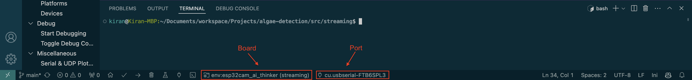
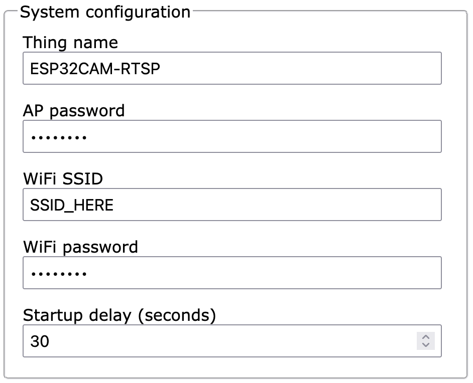
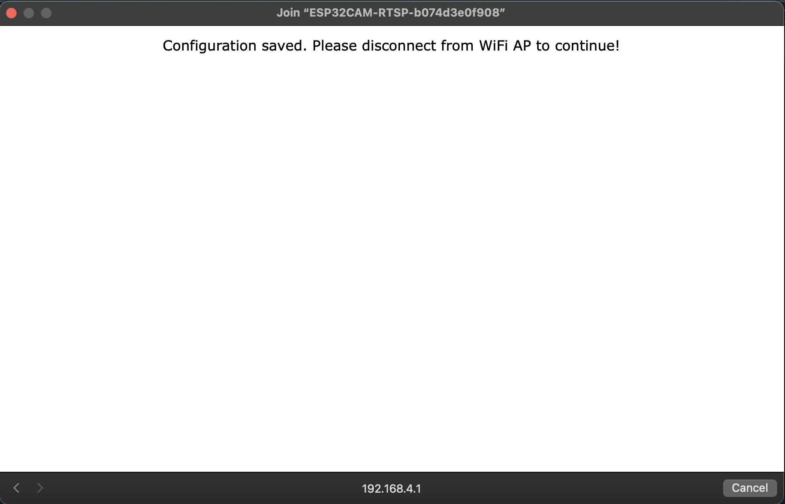
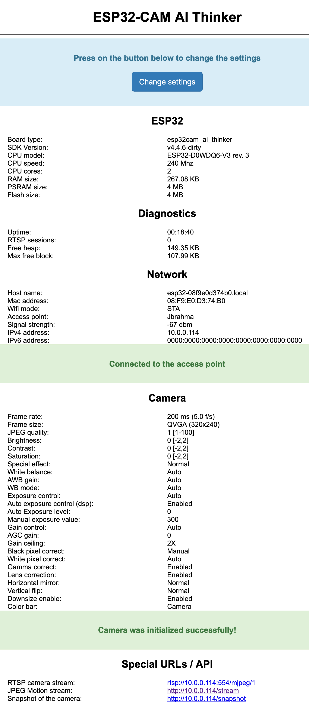

# Manual
## ESP32-CAM
> [!NOTE]
> * Current implementation **requires** WiFi!
>     * This is because the ESP32-CAM livestreams to an <a target="_blank" href="https://en.wikipedia.org/wiki/Motion_JPEG#Video_streaming">MJPEG server</a> over HTTP, which is how [`esp32.py`](../src/detection/esp32.py) gets the camera input.
>     * Unfortunately, WiFi connections from hotspots or SSOs are — in my experience — incompatible.
> 
> * If you're more of a visual learner, here's the <a target="_blank" href="https://youtu.be/SxlSjRWeGuw">YouTube tutorial + demo</a>.

### Initial Setup
<p>1. Complete all <a href="../README.md#installation">installation steps</a></p>

<details open>
   <summary>2. Click the PlatformIO icon in the activity bar, then click 'Pick a folder'</summary>
   <div align="center"></div>
</details>

<details open>
   <summary>3. Open <a href="../src/streaming"><code>streaming</code></a></summary>
   <div align="center"></div>
</details>

<details open>
   <summary>4. Connect the ESP32 to your computer with the Micro-USB cable, then select its board type and USB port at the bottom of the window</summary>
   <div align="center"></div>
</details>

<details open id="s5">
   <summary>5. Click 'Build' to compile code, then click 'Upload' to flash code to ESP32</summary>
   <div align="center"></div>
</details>

<details open>
   <summary>6. To connect initially to the device, connect to the WiFi network starting with <code>ESP32CAM-RTSP</code></summary>
   <div align="center"></div>
</details>

<details open>
   <summary>7. Click 'Change settings' once the browser automatically opens the home page (<a target="_blank" href="http://192.168.4.1">http://192.168.4.1</a>)</summary>
   <div align="center"></div>
</details>

<details open id="s8">
   <summary>8. You <b>MUST</b> fill in (1) <b>AP (i.e., Access Point) password</b>, (2) <b>WiFi SSID</b>, and, if applicable, (3) <b>WiFi password</b></summary>
   <div align="center"></div>
</details>

> [!NOTE]
> If you ever lose/forget the AP password, click 'Erase flash' (in PlatformIO's extension UI) to erase and reset the device, then follow [Step 5](#s5) and onwards again.

<details>
   <summary>9. Update the settings and configure camera options (you can always change them later), though be mindful of the settings you choose as they may affect the ESP32's performance</summary>
   <div align="center"></div>
</details>

<p style="text-align:left;">10. Scroll down and click 'Apply' to save settings</p>

<details open>
   <summary>11. Disconnect from the current network and reconnect to your WiFi in order to reset ESP32 and connect to the AP</summary>
   <div align="center"></div>
</details>

> [!IMPORTANT]
> You must reset the ESP32 (i.e., press its 'Reset' button) everytime you change the settings for it to take effect.

> [!NOTE]
> If there's an error screen saying it's unable to make a connection, try resetting the ESP32 first. It'll wait 30 seconds for a connection (can be changed in system configuration's 'Startup delay (seconds)' setting, shown in [Step 8](#s8)).
>
> Connect to the SSID, go to the ESP32's IP address and enter your credentials:
> - Username: `admin`
> - Password: AP password from [Step 8](#s8)

<p>12. Go back to PlatformIO extension, click 'Monitor', then use 'Find' keyboard shortcut to find the ESP32's IP address
   <ul>
      <li>PC<br><pre>Ctrl + F</pre></li>
      <li>Mac<br><pre>⌘ + F</pre></li>
   </ul>
</p>

<details open id="s13">
   <summary>13. After invoking the shortcut, type 'IP address' in the find box, press 'Enter', and copy the resulting IP address</summary>
   <div align="center"></div>
</details>

 <details id="s14">
    <summary>14. You can now stream from the ESP32</summary>
    <div align="center"></div>
 </details>
  <ul>
     <li>HTTP Motion JPEG Streamer: <code>http://&lt;IP address from <a href="#s13">Step 13</a>&gt;/snapshot</code></li>
     <li>HTTP Image: <code>http://&lt;IP address from <a href="#s13">Step 13</a>&gt;/snapshot</code></li>
     <li>RTSP: <code>rtsp://&lt;IP address from <a href="#s13">Step 13</a>&gt;:554/mjpeg/1</code></li>
  </ul>

> [!CAUTION]
> Anyone with network access to the device can see the streams and images!

> [!NOTE]
> Once the ESP32-CAM is setup successfully, you don't have to repeat these steps again; just plug in the ESP32-CAM and it's good to go! Stream URL remains the same as usual.
> 
> See <a target="_blank" href="https://github.com/rzeldent/esp32cam-rtsp">this module</a>'s <a target="_blank" href="https://github.com/rzeldent/esp32cam-rtsp/blob/main/README.md">`README.md`</a> for further details on [`streaming`](../src/streaming).
>
> To update to latest version, commit and push changes, then run the following command in the terminal:
> ```sh
> git subtree pull --prefix src/streaming https://github.com/rzeldent/esp32cam-rtsp.git develop --squash
> ```

### Usage
<p>1. <a href="#initial-setup">Successfully setup the ESP32-CAM</a></p>

<p>2. Activate <code>algae_env</code> (i.e., virtual environment)<br><pre>conda activate algae_env</pre></p>

> [!TIP]
> Convenient [Conda shortcut commands](../docs/appendix.md#conda-shortcuts) are available in [`conda_shortcuts.sh`](../scripts/conda_shortcuts.sh).

<p>3. Confirm <code>algae_env</code> is active</a>
   <ul>
      <li><code>algae_env</code> should be in parentheses () or brackets [] before your command prompt, e.g.<br><pre>(algae_env) $</pre></li>
      <li>See which virtual environments are available and/or currently active (active environment denoted with asterisk (*))<br><pre>conda info --envs</pre><b>OR</b><br><pre>conda env list</pre></li>
   </ul>
</p>

<p>4. Open <a href="../src/detection/esp32.py"><code>esp32.py</code></a></p>

<p>5. Assign HTTP (default) or RTSP ESP32 streaming link listed in <a href="#s14">Step 14</a> to <a href="../src/detection/esp32.py#L13"><code>URL</code></a></p>

<p>6. Run <a href="../src/detection/esp32.py"><code>esp32.py</code></a>
   <ul>
      <li>POSIX<br><pre>python src/detection/esp32.py</pre></li>
      <li>Windows<br><pre>python src\detection\esp32.py</pre></li>
   </ul>
</p>

<p>7. Press the 'Escape' key on your keyboard to terminate</p>

## Command Line Arguments
<table align="center" style="width: 100%; text-align: center; display: block; max-width: -moz-fit-content; max-width: fit-content; overflow-x: auto;">
    <thead>
    <tr>
        <th><center>Option</center></th>
        <th><center>Type</center></th>
        <th><center>Description</center></th>
        <th><center>Default</center></th>
    </tr>
    </thead>
    <tbody>
    <tr>
        <td style="white-space: nowrap;"><code>-H, --help</code></td>
        <td align="center"></td>
        <td align="center">Show help message and exit</td>
        <td align="center"></td>
    </tr>
    <tr>
        <td id="camera" align="center" style="white-space: nowrap;"><code>-C, --cam &lt;camera&gt;</code></td>
        <td align="center"><code>str</code></td>
        <td align="center">Set to livestream URL for ESP32-CAM, <code>0</code> for primary camera, <code>1</code> for secondary camera</td>
        <td align="center"></td>
    </tr>
    <tr>
        <td align="center" style="white-space: nowrap;"><code>-T, --title &lt;title&gt;</code></td>
        <td align="center"><code>str</code></td>
        <td align="center">Window title</td>
        <td align="center">"Custom Object Detection"</td>
    </tr>
    <tr>
        <td id="modpath" align="center" style="white-space: nowrap;"><code>-p, --path &lt;path&gt;</code></td>
        <td align="center"><code>str</code></td>
        <td align="center">Detection model's <a href="../src/detection/camera.py#L33">path</a></td>
        <td align="center"><a href="../weights/custom_yolov8n.pt"><code>weights/custom_yolov8n.pt</code></a></td>
    </tr>
    <tr>
        <td align="center" style="white-space: nowrap;"><code>-c, --conf &lt;confidence&gt;</code></td>
        <td align="center"><code>float</code></td>
        <td align="center">Detection model's minimum confidence threshold</td>
        <td align="center"><code>0.5</code></td>
    </tr>
    <tr>
        <td align="center" style="white-space: nowrap;"><code>-d, --device &lt;device&gt;</code></td>
        <td align="center"><code>str</code></td>
        <td align="center">Device running detection model</td>
        <td align="center">Available device</td>
    </tr>
    <tr>
        <td align="center" style="white-space: nowrap;"><code>-i, --iou &lt;iou&gt;</code></td>
        <td align="center"><code>float</code></td>
        <td align="center">Lower values eliminate overlapping boxes</td>
        <td align="center"><code>0.25</code></td>
    </tr>
    <tr>
        <td align="center" style="white-space: nowrap;"><code>-m, --max &lt;max-detections&gt;</code></td>
        <td align="center"><code>int</code></td>
        <td align="center">Limit number of detections per frame</td>
        <td align="center"><code>100</code></td>
    </tr>
    <tr>
        <td align="center" style="white-space: nowrap;"><code>-s, --strides &lt;strides&gt;</code></td>
        <td align="center"><code>int</code></td>
        <td align="center"><code>1</code> processes every frame, higher values skip frames</td>
        <td align="center"><code>1</code></td>
    </tr>
    <tr>
        <td align="center" style="white-space: nowrap;"><code>-w, --width &lt;width&gt;</code></td>
        <td align="center"><code>int</code></td>
        <td align="center">Camera width</td>
        <td align="center"><code>256</code></td>
    </tr>
    <tr>
        <td align="center" style="white-space: nowrap;"><code>-h, --height &lt;height&gt;</code></td>
        <td align="center"><code>int</code></td>
        <td align="center">Camera height</td>
        <td align="center"><code>256</code></td>
    </tr>
    <tr>
        <td align="center" style="white-space: nowrap;"><code>-f, --fps &lt;fps&gt;</code></td>
        <td align="center"><code>float</code></td>
        <td align="center">Camera frames per second</td>
        <td align="center"><code>30.0</code></td>
    </tr>
    <tr>
        <td id="nthreads" align="center" style="white-space: nowrap;"><code>-n, --n-threads &lt;threads&gt;</code></td>
        <td align="center"><code>int</code></td>
        <td align="center">Number of video processing threads</td>
        <td align="center"><code>0</code></td>
    </tr>
    <tr>
        <td align="center" style="white-space: nowrap;"><code>-b, --buffer</code></td>
        <td align="center"><code>bool</code></td>
        <td align="center"><code>True</code>: All frames are buffered during video stream processing; <code>False</code>: Model should return most recent frame</td>
        <td align="center"><code>True</code></td>
    </tr>
    </tbody>
</table>

## Train, Validate, and Test Model
<p>1. Visit one of these Google Colab notebooks, depending on the version of YOLO you want to use
   <ul>
      <li><a target="_blank" alt="Object detection Google Colab notebook (YOLOv8)" href="https://colab.research.google.com/drive/19X4aGWTeXQbgEKVteR9qrgit67jNxkmJ">Object Detection (YOLOv8).ipynb</a></li>
      <li><a target="_blank" alt="Object detection Google Colab notebook (YOLOv9)" href="https://colab.research.google.com/drive/1abvT_xQ7MhkYLTMTGvqAkGuDdehZ-u80">Object Detection (YOLOv9).ipynb</a></li>
   </ul>
</p>

<p>2. Follow the notebook's instructions step-by-step</p>

## Select Model
> [!IMPORTANT]
> All models are available at and can be downloaded from <a target="_blank" href="https://github.com/lynkos/algae-detection/releases/tag/weights">this repo's releases</a>!

1. Get path of the algae detection model you want to use
    * <a target="_blank" href="https://github.com/lynkos/algae-detection/releases/tag/weights">Download weight(s)</a>, then add to <a href="../weights"><code>weights</code></a>
    * To use your own, <a href="#train-validate-and-test-model">create custom model</a> then add to <a href="../weights"><code>weights</code></a>
    * Default weight is <a href="../weights/custom_yolov8n.pt"><code>custom_yolov8n.pt</code></a>

2. Update <a href="../src/detection/camera.py"><code>camera.py</code></a>'s constructor parameter <a href="../src/detection/camera.py#L33"><code>model</code></a> (i.e., default model's path) accordingly