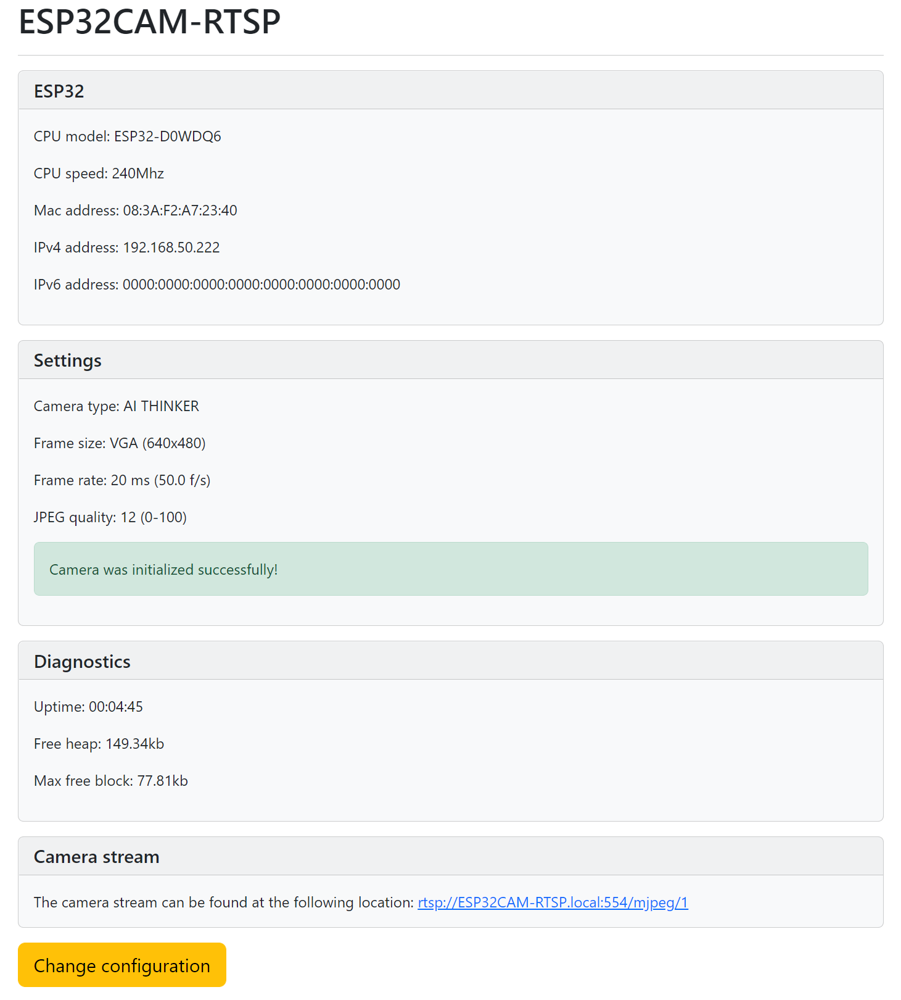

# ESP32CAM-RTSP

Simple [RTSP](https://en.wikipedia.org/wiki/Real_Time_Streaming_Protocol), [HTTP JPEG Streamer](https://en.wikipedia.org/wiki/Motion_JPEG) and image server with configuration through the web interface.

Flashing this software on a ESP32CAM module will make it a **RTSP streaming camera** server, a **HTTP Motion JPEG streamer** and a **HTTP image server**.

Supported protocols

- RTSP
  The RTSP protocol is an industry standard and allows many CCTV systems and applications (like for example [VLC](https://www.videolan.org/vlc/)) to connect directly to the ESP32CAM camera stream.
  It is also possible to stream directly to a server using [ffmpeg](https://ffmpeg.org).
  This makes the module a camera server allowing recording and the stream can be stored on a disk and replayed later.
  The URL is rtsp://&lt;ip address&gt;:554/mjpeg/1

- HTTP Motion JPEG
  The HTTP JPEG streamer makes it possible to watch the camera stream directly in your browser.
  The URL is http://&lt;ip address&gt;/stream

- HTTP image
  The HTTP Image returns an HTTP JPEG image of the camera.
  The URL is http://&lt;ip address&gt;/snapshot

The software provides a **configuration web server**, that can be used to:

- Provide information about the state of the device, wifi connection and camera,
- Set the WiFi parameters,
- Set the timeout for connecting to the access point,
- Set an access password,
- Select the image size,
- Select the frame rate,
- Select the JPEG quality
- Enable the use of the PSRAM
- Set the number of frame buffers
- Configure the camera options:
  - Brightness
  - Contrast
  - Saturation
  - Special effect (Normal, Negative, Gray-scale, Red/Green/Blue tint, Sepia)
  - White balance
  - Automatic White Balance gain
  - Wite Balance mode
  - Exposure control
  - Auto Exposure (dsp)
  - Auto Exposure level
  - Manual exposure value
  - Gain control
  - Manual gain control
  - Auto gain ceiling
  - Black pixel correction
  - White pixel correction
  - Gamma correction
  - Lens correction
  - Horizontal mirror
  - Vertical flip
  - Downside enable
  - Color bar

The software provides contains also a mDNS server to be easily discoverable on the local network.
It advertises HTTP (port 80) and RTSP (port 554)

## Required

- ESP32-CAM module or similar
- USB-C cable
- [Visual Studio Code](https://code.visualstudio.com)
- [PlatformIO plugin for Visual Studio Code](https://docs.platformio.org/en/stable/integration/ide/vscode.html)

## Compiling and deploying the software

Open a command line or terminal window and go into the folder

```sh
cd streaming
```

Next, the firmware has to be build and deployed to the ESP32. Open the project in a new window. Run the following tasks using the ```Terminal -> Run Task``` or `CTRL + ALT + T` command in the menu (or use the icons below on the toolbar). Make sure the ESP32-CAM is in download mode during the uploads.

- PlatformIO: Build (esp32cam)
- PlatformIO: Upload (esp32cam)

To monitor the behavior run the task, run: ```PlatformIO: Monitor (esp32cam)```

## Setting up the ESP32CAM-RTSP

After the programming of the ESP32, there is no configuration present. This needs to be added.
To connect initially to the device open the WiFi connections and select the WiFi network / access point called **ESP32CAM-RTSP**.
Initially there is no password present.

After connecting, the browser should automatically open the status page.
In case this does not happens automatically, connect to [http://192.168.4.1](http://192.168.4.1).
This page will display the current settings and status. On the bottom, there is a link to the config. Click on this link.

This link brings up the configuration screen when connecting fot the first time.


Configure at least:

- The access point to connect to. No dropdown is present to show available networks!
- A password for accessing the Access point (AP) when starting. (required)
- Type of the ESP32-CAM board

When finished press ```Apply``` to save the configuration. The screen will redirect to the status screen.
Here it is possible to reboot the device so the settings take effect.
It is also possible to restart manually by pressing the reset button.

## Connecting to the configuration

After the initial configuration and the device is connected to an access point, the device can be configured over http.

When a connection is made to [http://esp32cam-rtsp](http://esp32cam-rtsp) the status screen is shown.



In case changes have been made to the configuration, this is shown and the possibility to restart is given.

Clicking on the ```change configuration``` button will open the configuration. It is possible that a password dialog is shown before entering.
If this happens, for the user enter 'admin' and for the password the value that has been configured as the Access Point password.

## Connecting to stream

The streaming server is available using a normal web browser at: [http://esp32cam-rtsp.local:/stream](http://esp32cam-rtsp.local/stream).

:bangbang: **Please be aware that there is no password present!**.
Everybody with network access to the device can see the streams or images! Beware of :trollface:!

## API

There is a minimum API present to perform some tasks using HTTP requests. For some requests authentication is required.
The authentication used is basic authentication. The user is always admin and the password the access point key.\
If using a browser, remember that the authentication is stored in the browser session so needs to be entered only once.

### `GET: /restart`

Calling this URL will restart the device. Authentication is required.

### `GET: /config`

Calling this URL will start the form for configuring the device in the browser. Authentication is required.

### `GET: /snapshot`

Calling this URL will return a JPEG snapshot of the camera in the browser.
This request can also be used (for example using cURL) to save the snapshot to a file.

## Issues / Nice to know

- For the JPEG quality setting, a lower number means higher quality.
  Be aware that a very high quality (low number) can cause the ESP32 cam to crash or return no image.
- The red LED on the back of the device indicates the device is not connected.
- Sometimes after configuration a reboot is required.
  If the error screen is shown that it is unable to make a connection, first try to reboot the device,
- When booting, the device waits 30 seconds for a connection (configurable).
  You can make a connection to the SSID and log in using the credentials below,
- When connected, go to the ip of the device and, when prompted for the credentials, enter 'admin' and the AP password.
  This is a **required** field before saving the credentials,
- When the password is lost, a fix is to completely erase the ESP32 using the ```pio run -t erase``` command.
  This will reset the device including configuration.
  If using the esptool, you can do this using ```esptool.py --chip esp32 --port /dev/ttyUSB0 erase_flash```.
  However, after erasing, re-flashing of the firmware is required.
- When finished configuring for the first time and the access point is entered, disconnect from the wireless network provided by the device.
  This should reset the device and connect to the access point.
  Resetting is also a good alternative...

## Credits

esp32cam-rtsp depends on PlatformIO, Bootstrap 5 and Micro-RTSP by Kevin Hester.